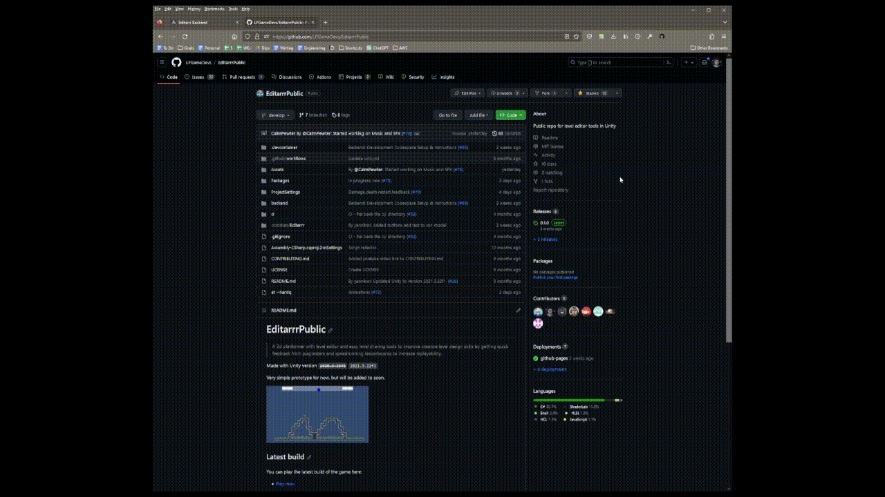
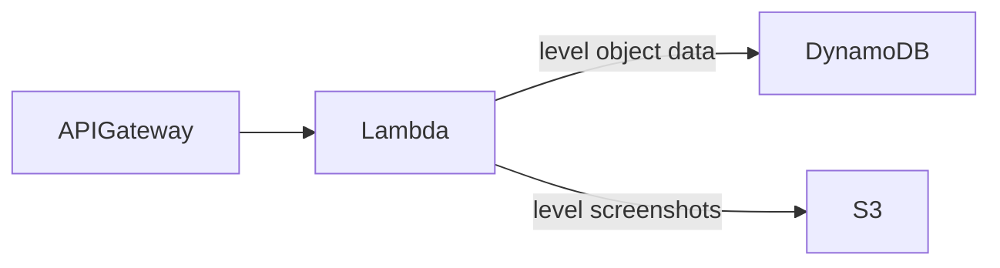
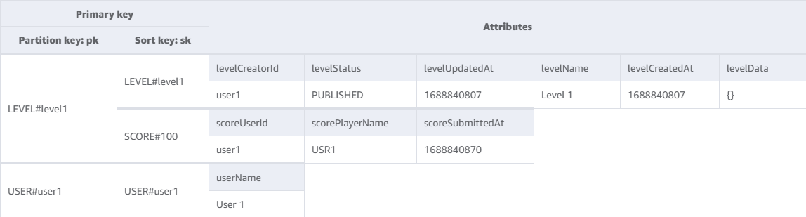
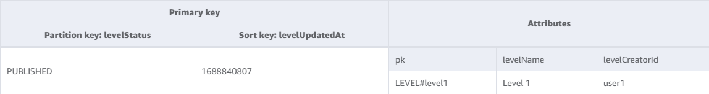
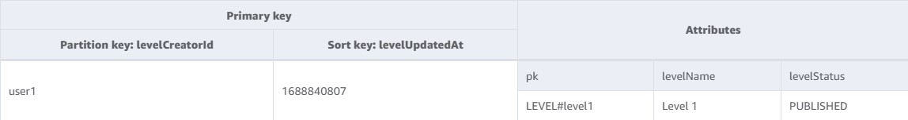

# Editarrr Backend

Backend storage to persist player-created levels, images, scores, and analytics.

## How to Develop
There is a [GitHub Codespace configuration for this repo](../.devcontainer/devcontainer.json) 
that you can use that comes with all the dependencies 
([Docker](https://www.docker.com/products/docker-desktop/), 
[AWS CLI](https://docs.aws.amazon.com/cli/latest/userguide/getting-started-install.html), 
[AWS SAM CLI](https://aws.amazon.com/serverless/sam/)) 
pre-installed. 

To open your own Codepsace, from the repo homepage, simply click `Code > Create a codespace on develop`:



More on using GitHub codespaces [here](https://docs.github.com/en/codespaces/getting-started/quickstart)).

To start the backend, from the Codespace, run shell script:
```sh
cd backend
./scripts/start-local.sh # Starts the DynamoDB, API Gateway, and Lambda locally
```

You can make requests locally using the scripts in the [requests](./requests/) directory:
```sh
./requests/post.sh
./requests/get-all.sh
```
(if you want to make remote requests to the actual AWS service, set `export REMOTE=true`)

## Architecture


We use [terraform](./terraform/README.md) to deploy the cloud services (do NOT use the CloudFormation folder - that's left over from development).

## APIs
The APIs will be called by the `IDbConnector` interface in Unity via HTTP requests with authentication

The structure for each API can be tailored to whatever the JSON schema for the C# objects in the game ends up being.

The backend API would have the following APIs:

### Create Level

**POST `/levels`**

**Request:**
```json
{
  "name": "Name of Level",
  "creator": {
    "id": "UUID",
    "name": "User 1"
  }
  "status": "published|draft",
  "data": {}, // This can be whatever Unity needs
}
```

**Response:**
```json
{
  "message": "Success or Error"
}
```

### Get Levels

**GET `/levels`**

**Query Params:**
* `status` (Required) filters to levels of the provided status
* `limit` (Optional) page limit, default: 10
* `skip` (Optional) page skip, default: 0
* `creator-id` (Optional) filters to levels for a creator

**Response:**
```json
{
  "levels": [ // default sort order: most recently updated
    {
      "id": "UUID",
      "name": "Name of Level",
      "creator": {
        "id": "UUID",
        "name": "User DisplayName"
      },
      "status": "published|draft",
      "createdAt": 1686495335,
      "updatedAt": 1686495335,
    }
  ]
}
```

### Get Level

**GET `/levels/{id}`**

**Response:**
```json
{
  "id": "UUID",
  "name": "Name of Level",
  "creator": {
    "id": "UUID",
    "name": "User DisplayName"
  },
  "status": "published|draft",
  "createdAt": 1686495335,
  "updatedAt": 1686495335,
  "data": {}
}
```

### Update Level

**PATCH `/levels/{id}`**

**Request:**
```json
// At least one of these 3 fields needs be provided. All other fields not provided will remain unchanged
{
  "name": "Name of Level",
  "status": "published|draft",
  "data": {}, // The 'data' is replaced as a whole with whatever is provided
}
```

**Response:**
```json
{
  "message": "Success or Error"
}
```

### Upload Screenshot

**POST `/screenshot/{filename}`**

### Add High Score For Level

**POST `/levels/{id}/scores`**

**Request:**
```json
{
  "score": 123,
  "code": "Level Name",
  "creator": "Player ID",
  "creatorName": "Player Name"
}
```

**Response:**
```json
{
  "message": "Success or Error"
}
```

### Get High Scores For Level

**GET `/levels/{id}/scores`**

**Response:**
```json
{
  "scores": [ // Default: 10 highest scores, from highest to lowest
    {
      "scoreId": "<UUID>",
      "levelId": "<LEVEL_ID>",
      // TODO left off here
      "score": 123,
      "code": "<LEVEL_NAME>",
      "creator": {
        "id": "<USER_ID>",
        "name": "<USER_NAME>"
      },
      "submittedAt": 1686495335
    }
  ]
}
```

TODO At some point, if the project grows enough, look into RAML or Swagger or something for managing, encoding & documenting these definitions.


## Database

[AWS DynamoDB](https://aws.amazon.com/dynamodb/) is the current storage for Editarrr levels. 

### Schema
See the [Terraform configuration](./terraform/4-dynamodb-table.tf) for the DB schema.





### About DynamoDB
We don’t have complex query requirements, so we chose to go with a simple NoSQL key-value store and selected DynamoDB.
* AWS DynamoDB is a NoSQL key-value storage
* A DynamoDB consists of
  * Tables that have Items (think rows in the table)
  * Items have Attributes (think columns in the table)
* DynamoDB is schemaless, so there isn't any enforcement of attributes _except_ for key attributes
* Every Item in the table _must_ have an attribute(s) that serve as the primary key. The primary key can either:
  * Be a single, unique value 
  * A Partition Key (aka "Hash Attribute") + Sort Key (aka "Range Attribute") 
* If the Table uses a PK + SK, then the data is stored into partitions of sorted items (think a folder of sorted files)
* Tables can have Global Secondary Indices (GSIs) that create duplicate tables organized with different attributes as PKs (and SKs) to support different queries

DynamoDB Best Practices:
* [As few tables as possible; keep related data together](https://docs.aws.amazon.com/amazondynamodb/latest/developerguide/bp-general-nosql-design.html)
* [Effective and efficient use of DDB means avoiding Scan() and avoiding the use of filterExpressions that you know will throw away lots of the data read.](https://stackoverflow.com/questions/64557433/how-to-query-and-order-on-two-separate-sort-keys-in-dynamodb)
* Try to not use IDs as keys if appropriate - they have limited queries they can support. But keep in mind that dynamic attributes won't serve as keys either
* Partition Keys - Ideally high cardinality and evenly distributed set of possible partition keys to avoid hotspots (since DynamoDB actually partitions based on this, meaning hotspots don't scale)
* Sort Keys - [consider how it could be used for range queries](https://docs.aws.amazon.com/amazondynamodb/latest/developerguide/bp-sort-keys.html)
  * Consider if there’s anything hierarchical you could represent with it. 
    * Use composite keys of attributes to guarantee uniqueness (e.g. partition key: customerID#productID#countryCode, sort key: orderDate). 
      * But then, that attributes is literally a concatenated strings…so you have to plan this ahead ([you can NOT use individual attributes](https://stackoverflow.com/questions/64356291/setting-composite-sort-keys-for-dynamodb-with-serverless-framework)) 
      * [Setting composite sort keys for dynamodb with serverless framework - Stack Overflow](https://stackoverflow.com/questions/64356291/setting-composite-sort-keys-for-dynamodb-with-serverless-framework)


### Data Schema Decision History

#### June 2023 - Initializing the Table
In DynamoDB, it is critical to understand the expected queries in order to plan the appropriate partition key / sort key schema for the database.

When initially designing the Editarrr Level Storage Table schema, the following queries were accounted for:
1. Get details about a specific level
2. Get a paged list published level metadata, sorted by most recently updated
3. Get a paged list of level metadata for a user, filtered by status, sorted by most recently updated
4. Get the top 10 highest scores and the player who got them for a level  

The design we came up with calls for 3 "types" of items with the following PK+SKs:
1. Level Items (PK: `LEVEL#<levelId>`, SK: `LEVEL#<levelId>`)
2. Level Score Items (PK: `LEVEL#<levelId>`, SK: `SCORE#<score>`)
3. User Items (PK: `USER#<userId>`, SK: `USER#<userId>`)

Strengths of the design:
* All defined queries are supported by either the PK/SK structure or a GSI
* Main partitions are high-cardinality
* Sorting of high scores & most recently updated levels is taken care of by the database
* Generic "pk" and "sk" means there's flexibility to add new types of items into the table

Weaknesses of the design:
* Hot spot partition of levels by status in the GSI. We've decided to accept this tradeoff because the scale of our data is expected to be low. If this really becomes a problem, we could have a denormalized store and maintaining only the 10 latest levels

Alternates Considered:
| Description | Problems |
| - | - |
| PK: User + SK: Level |  Problems: You can't query directly for a single level w/o a GSI, maintaining a sorted list of scores might get expensive |
| Same schema, no GSIs | Expensive Scans operations, which would likely incur latency & costs |


## Background

The Editarrr game code has the following interface for interacting with level storage:

```csharp
public interface IDbConnector
    {
        void GetData(string levelCode);

        void GetUniqueCode();
        void CreateData(string code, string levelData);
        void UpdateData(string code, string levelData);
        void CreateComment(string code, string time);
        void CreateComment(string code, string time, string ghost);
        void GetComments(string code);
    }
```

> *They are all void callbacks btw because they are asynchronous requests so the responses come back later and need listeners to be responded to. Bit of a pain but means there is no waiting*
> 
> 
> *"Comment" is actually badly labelled. That should be LevelCompleteTime or something like that.*
> 
> *Basically there were two "entities" in the old system. One is a level which contains all the tiles, who created it and whether it is published or not.*
> 
> *The other is a PlayTime which is the level, the time, the player and later on the "ghost" which is a recording of the player transforms for replays.
> In the new system we will want a third entity which is a rating or review.*
> 

For the initial Editarrr Level Design Challenge hosted Nov thru Dec 2022, the level storage was implemented by @yanniboi using [Drupal CMS](https://drupal.org/). It used a `json-api` plugin to store all the data directly in Drupal (configured with MySQL as the database).

The benefits of this approach were appropriate for the Level Design Challenge because the CMS provided an out-of-the-box level browser (via a web browser).

However, the primary weakness of this approach was the work and code required to translate the C# objects into the required JSON schema. The C# objects have a requirement that there can only be one level of nesting, whereas the JSON schema had many levels of nesting, which meant a lot of code to translate between the C# objects and the JSON schema.

The level of effort to translate data structures combined with the desire to have the level browser accessible in-game (negating the benefits of DrupalCMS) is why we’re going to implement a new backend level storage for the next iteration of Editarrr.

### Backend Requirements

See mockups of the UI [here](https://github.com/LPGameDevs/EditarrrPublic/wiki/Scene-Mockups)

#### Functional (V1)

- Player Identification
    - Loose identification of a player for the sake of associating levels with them.
    - Players should be able to choose to set a display name (or not). No uniqueness constraints around the display name
    - We must NOT require accounts, registration, or login. We must keep the barrier to participation low. At our current small scale and player base, we can trust our audience.
- Level Storage
    - As JSON files
    - Metadata, including Name, Creator, Created/Updated Timestamp, State (draft|published), High Scores, Preview Image PNG files
- Access
    - Any player can play anyone’s published level
    - No one can edit/delete published levels
    - Only the creator can see/edit/publish/delete their draft levels
- APIs
    - APIs must be callable from the game (Unity, C#)
    - Support GET/POST APIs that use the C# serializable game objects with minimal nesting
    - APIs should have some authentication to ensure that only the game and game developers are making calls to it
    - APIs to:
        - CRUD Individual Levels (NOT querying levels)
        - Upload a preview image for a level
        - Download a preview image for a level 
        - Add a new high score for a published level
        - Get a sorted & paged list of high scores for a level

#### Non-Functional

- Infrastructure must be low cost (Budget: <$5/month)
- Simplicity - as an open-source, community project, it should be easy for new developers to understand the system and contribute
- Flexibility - it should be easy for us to swap out the backends and have alternative storage options if we choose to switch or support multiple at once

#### Nice to Have

- The ability for a player to “login to their account” from different devices
- Make the backend generic, so that other games can use it for level storage

#### Out-of-Scope

- Store private player feedback associated with levels (https://github.com/LPGameDevs/EditarrrPublic/issues/42) (only viewable by level creator). This feedback should be reviewable by “Admins”
- Store player ratings associated with levels (https://github.com/LPGameDevs/EditarrrPublic/issues/42) (only viewable by level creator)
    - Public rating count
    - Players should be able to see which levels they left comments & ratings for
- Other players can make duplicates of public levels and make edits to their duplicates
- Levels protected and shared by codes
- Browsing levels, filtering by criteria, page results, showing metadata (but not the level itself)

### Implementation Options

#### Current
AWS:
- API Gateway in front of Lambda Functions
- DynamoDB for storage of the level objects
- S3 for storage of the level preview images

Pros: 
- Many developers are familiar with AWS
- Contributors might be interested in tinkering & learning AWS

Cons:
- AWS can get expensive, but unlikely to be a problem given the low scale we’re dealing with

#### Alternates Considered

- Cloud Providers
    - DigitalOcean (Pro: yanniboi often has some up for work that can be piggybacked on)
    - Steam Client & Backend (NOT because could only be played in Steam, not Itch or other places)
- Compute
    - AWS EC2 (NOT because likely to be more expensive for this small scale project)
    - AWS EKS (NOT because more management & complexity than needed for this small scale project)
- Storage
    - RDS (Aurora Serverless) (NOT because likely more expensive for this small scale project)

### Cost Estimation

Estimates:

- Users: 100
- API Requests: 100 users * 50 requests / day * 30 days / month = 150K / month
- Level & Metadata Data Storage: 100 levels / user * 100 users * 10KB = 100MB
- Screenshot Data Storage: 100 levels / user * 100 users * 1 screenshot / level * 250 KB / screenshot = 2.5 GB

The proposed implementation would cost an estimated [$1.72/month (AWS)](https://calculator.aws/#/estimate?id=75f59bb0e9f19e8fdd56429c47d50bc573fc096c). 

It assumes:

- 2GB of S3 storage
- 4GB of DynamoDB
- Lambda: Number of requests (240000 per month), Amount of ephemeral storage allocated (512 MB)
- API Gateway: HTTP API requests units (millions), Average size of each request (34 KB), REST API request units (millions), Cache memory size (GB) (None), WebSocket message units (thousands), Average message size (32 KB), Requests (0.1 per month)

> It's more likely to be zero dollars at first as this is assuming we're getting 1000 new map writes a day and reading 10,000, storing 2gb of images, 4gb of database data, and a request load of ~100,000/month. Almost all of which would be covered in the free tier anyway.
> 

Alternate: $5/month (Digital Ocean boxes)

### Implementation Details

#### API Authentication

****To ensure bad actors aren’t using our cloud services****

TBD

#### User Identification

Generate a random ID for every game client. This ID is used as “user identification”. This ID is stored on the player’s device (Unity PlayerPrefs).

Bonus: We could expose this to the player and give them the option to set it if they want to “login” from different devices.

Open Questions: 
- [ ] Should we encrypt or anything on storage?
- [ ] How to generate the random ID? Maybe could hash based on the device or something to guarantee uniqueness (but it would be very low probability that a randomly generated ID would pose problems, given our small player base)

#### Language

NodeJS, because it has the strongest documentation and support for AWS Lambda (it's the default in the tutorial). 

Alternates ([AWS Lambda supported](https://docs.aws.amazon.com/lambda/latest/dg/lambda-runtimes.html)):

- C# (.NET) (Pro: Unity client code and the server are using the same language, making it easier for contributors to switch between the two. However, the AWS Lambda support & documentation seems weaker, which pushed us in the direction of NodeJS)
- Python (Pro: better AWS Lambda support than C#, less than NodeJS in terms of documentation)
- Java
- Go (Pro: MurphysDad has a lot of familiarity)
- Ruby

### Action Items (https://github.com/LPGameDevs/EditarrrPublic/issues/48)

**All open Issues related to the backend can be found [here](https://github.com/LPGameDevs/EditarrrPublic/issues?q=is%3Aopen+is%3Aissue+label%3Abackend)**

- [ ] Set up the cloud services (https://github.com/LPGameDevs/EditarrrPublic/issues/48)
- [x] Set up a repo
- [ ] Define the APIs & DB Storage (https://github.com/LPGameDevs/EditarrrPublic/issues/53)
- [ ] Implement APIs
    - [ ] Level Data APIs (https://github.com/LPGameDevs/EditarrrPublic/issues/54)
    - [ ] Preview Image APIs (https://github.com/LPGameDevs/EditarrrPublic/issues/55)
    - [ ] High Score APIs (https://github.com/LPGameDevs/EditarrrPublic/issues/56)

### Appendix

[Discord Discussion](https://discord.com/channels/716412098242150421/1094247243097325678)

https://github.com/LPGameDevs/EditarrrPublic/discussions/47 

Example of DrupalCMS `json-api` format:

```json
{
  "data": {
    "type": "node--level",
    "attributes": {
      "title": "[Level Code]",
      "status": true,
      "body": {
        "value": "A level by [username]",
        "format": "plain_text"
      },
      "field_data": {
        "value": "{}"
      }
    }
  }
}
```

Example of C# code required to convert the objects to the `json-api` format for POSTs:

```json
DrupalRequest request = new DrupalRequest
            {
                data = new DrupalRequestData
                {
                    attributes = new DrupalNodeData()
                    {
                        title = code,
                        body = new DrupalFieldValue($"Level {code} by {user}"),
                        status = false,
                        field_data = data,
                        field_user = user,
                    }
                }
            };

....

        [Serializable]
        public class DrupalRequest
        {
            public DrupalRequestData data;
        }

        [Serializable]
        public class DrupalRequestData
        {
            public string type = "node--level";
            public DrupalNodeData attributes;
        }

        [Serializable]
        public class DrupalNodeData
        {
            public string title;
            public DrupalFieldValue body;
            public string field_data;
            public bool status;
            public string field_user;
        }

...etc
```

<details>
<summary>Example GET DrupalCMS `json-api`:</summary>
```json
{
  "jsonapi": {
    "version": "1.0",
    "meta": {
      "links": {
        "self": {
          "href": "http:\/\/jsonapi.org\/format\/1.0\/"
        }
      }
    }
  },
  "data": [
    {
      "type": "node--level",
      "id": "68089a61-7565-4b44-ab2b-35ded5d1f8e6",
      "links": {
        "self": {
          "href": "https:\/\/tower-offender.ddev.site\/jsonapi\/node\/level\/68089a61-7565-4b44-ab2b-35ded5d1f8e6?resourceVersion=id%3A124"
        }
      },
      "attributes": {
        "drupal_internal__nid": 101,
        "drupal_internal__vid": 124,
        "langcode": "en",
        "revision_timestamp": "2022-09-01T13:24:49+00:00",
        "revision_log": null,
        "status": true,
        "title": "jc698",
        "created": "2022-09-01T13:24:49+00:00",
        "changed": "2022-09-01T13:24:49+00:00",
        "promote": false,
        "sticky": false,
        "default_langcode": true,
        "revision_translation_affected": true,
        "path": {
          "alias": null,
          "pid": null,
          "langcode": "en"
        },
        "body": {
          "value": "Level jc698 by yanniboi",
          "format": null,
          "processed": "<p>Level jc698 by yanniboi<\/p>\n",
          "summary": null
        },
        "comment": {
          "status": 2,
          "cid": 0,
          "last_comment_timestamp": 1662038689,
          "last_comment_name": "",
          "last_comment_uid": 5,
          "comment_count": 0
        },
        "field_data": "{\"creator\":\"yanniboi\",\"platformTiles\":[],\"groundTiles\":[],\"wallTiles\":[{\"x\":-15,\"y\":-9,\"z\":0},{\"x\":-14,\"y\":-9,\"z\":0},{\"x\":-13,\"y\":-9,\"z\":0},{\"x\":-12,\"y\":-9,\"z\":0},{\"x\":-11,\"y\":-9,\"z\":0},{\"x\":-10,\"y\":-9,\"z\":0},{\"x\":-9,\"y\":-9,\"z\":0},{\"x\":-8,\"y\":-9,\"z\":0},{\"x\":-7,\"y\":-9,\"z\":0},{\"x\":-6,\"y\":-9,\"z\":0},{\"x\":-5,\"y\":-9,\"z\":0},{\"x\":-4,\"y\":-9,\"z\":0},{\"x\":-3,\"y\":-9,\"z\":0},{\"x\":-2,\"y\":-9,\"z\":0},{\"x\":-1,\"y\":-9,\"z\":0},{\"x\":0,\"y\":-9,\"z\":0},{\"x\":1,\"y\":-9,\"z\":0},{\"x\":2,\"y\":-9,\"z\":0},{\"x\":3,\"y\":-9,\"z\":0},{\"x\":4,\"y\":-9,\"z\":0},{\"x\":5,\"y\":-9,\"z\":0},{\"x\":6,\"y\":-9,\"z\":0},{\"x\":7,\"y\":-9,\"z\":0},{\"x\":8,\"y\":-9,\"z\":0},{\"x\":9,\"y\":-9,\"z\":0},{\"x\":10,\"y\":-9,\"z\":0},{\"x\":11,\"y\":-9,\"z\":0},{\"x\":12,\"y\":-9,\"z\":0},{\"x\":13,\"y\":-9,\"z\":0},{\"x\":14,\"y\":-9,\"z\":0},{\"x\":15,\"y\":-9,\"z\":0},{\"x\":-11,\"y\":-8,\"z\":0},{\"x\":-11,\"y\":-7,\"z\":0},{\"x\":-10,\"y\":-6,\"z\":0},{\"x\":-10,\"y\":-5,\"z\":0},{\"x\":-9,\"y\":-5,\"z\":0},{\"x\":-9,\"y\":-4,\"z\":0},{\"x\":-8,\"y\":-4,\"z\":0},{\"x\":-7,\"y\":-4,\"z\":0},{\"x\":-7,\"y\":-3,\"z\":0},{\"x\":-6,\"y\":-3,\"z\":0},{\"x\":-5,\"y\":-3,\"z\":0},{\"x\":-4,\"y\":-3,\"z\":0},{\"x\":-3,\"y\":-3,\"z\":0},{\"x\":-2,\"y\":-3,\"z\":0},{\"x\":-2,\"y\":-2,\"z\":0},{\"x\":-1,\"y\":-2,\"z\":0},{\"x\":0,\"y\":-2,\"z\":0},{\"x\":1,\"y\":-2,\"z\":0},{\"x\":2,\"y\":-2,\"z\":0},{\"x\":3,\"y\":-2,\"z\":0},{\"x\":4,\"y\":-2,\"z\":0},{\"x\":5,\"y\":-2,\"z\":0},{\"x\":6,\"y\":-3,\"z\":0},{\"x\":7,\"y\":-3,\"z\":0},{\"x\":8,\"y\":-3,\"z\":0},{\"x\":9,\"y\":-3,\"z\":0},{\"x\":9,\"y\":-4,\"z\":0},{\"x\":10,\"y\":-4,\"z\":0},{\"x\":11,\"y\":-5,\"z\":0},{\"x\":11,\"y\":-6,\"z\":0},{\"x\":12,\"y\":-6,\"z\":0},{\"x\":12,\"y\":-7,\"z\":0},{\"x\":13,\"y\":-7,\"z\":0},{\"x\":13,\"y\":-8,\"z\":0}],\"spikeTiles\":[{\"x\":-4,\"y\":0,\"z\":0},{\"x\":-4,\"y\":-1,\"z\":0},{\"x\":-3,\"y\":-1,\"z\":0},{\"x\":-3,\"y\":-2,\"z\":0},{\"x\":7,\"y\":0,\"z\":0},{\"x\":7,\"y\":-1,\"z\":0},{\"x\":6,\"y\":-1,\"z\":0},{\"x\":6,\"y\":-2,\"z\":0}],\"enemyTiles\":[],\"enemyFollowTiles\":[],\"playerSpawn\":{\"x\":-4,\"y\":-8,\"z\":0},\"playerWin\":{\"x\":4,\"y\":-8,\"z\":0}}",
        "field_user": "yanniboi"
      },
      "relationships": {
        "node_type": {
          "data": {
            "type": "node_type--node_type",
            "id": "18fead21-57ff-424d-8a36-5c30a86846cb",
            "meta": {
              "drupal_internal__target_id": "level"
            }
          },
          "links": {
            "related": {
              "href": "https:\/\/tower-offender.ddev.site\/jsonapi\/node\/level\/68089a61-7565-4b44-ab2b-35ded5d1f8e6\/node_type?resourceVersion=id%3A124"
            },
            "self": {
              "href": "https:\/\/tower-offender.ddev.site\/jsonapi\/node\/level\/68089a61-7565-4b44-ab2b-35ded5d1f8e6\/relationships\/node_type?resourceVersion=id%3A124"
            }
          }
        },
        "revision_uid": {
          "data": {
            "type": "user--user",
            "id": "2599e218-ba8e-408e-ae82-6cc20e55f779",
            "meta": {
              "drupal_internal__target_id": 5
            }
          },
          "links": {
            "related": {
              "href": "https:\/\/tower-offender.ddev.site\/jsonapi\/node\/level\/68089a61-7565-4b44-ab2b-35ded5d1f8e6\/revision_uid?resourceVersion=id%3A124"
            },
            "self": {
              "href": "https:\/\/tower-offender.ddev.site\/jsonapi\/node\/level\/68089a61-7565-4b44-ab2b-35ded5d1f8e6\/relationships\/revision_uid?resourceVersion=id%3A124"
            }
          }
        },
        "uid": {
          "data": {
            "type": "user--user",
            "id": "2599e218-ba8e-408e-ae82-6cc20e55f779",
            "meta": {
              "drupal_internal__target_id": 5
            }
          },
          "links": {
            "related": {
              "href": "https:\/\/tower-offender.ddev.site\/jsonapi\/node\/level\/68089a61-7565-4b44-ab2b-35ded5d1f8e6\/uid?resourceVersion=id%3A124"
            },
            "self": {
              "href": "https:\/\/tower-offender.ddev.site\/jsonapi\/node\/level\/68089a61-7565-4b44-ab2b-35ded5d1f8e6\/relationships\/uid?resourceVersion=id%3A124"
            }
          }
        },
        "field_mt_alb_tags": {
          "data": [
            {
              "type": "taxonomy_term--level_tags",
              "id": "8e780e84-0b1f-4727-8241-54c69547235a",
              "meta": {
                "drupal_internal__target_id": 47
              }
            }
          ],
          "links": {
            "related": {
              "href": "https:\/\/tower-offender.ddev.site\/jsonapi\/node\/level\/68089a61-7565-4b44-ab2b-35ded5d1f8e6\/field_mt_alb_tags?resourceVersion=id%3A124"
            },
            "self": {
              "href": "https:\/\/tower-offender.ddev.site\/jsonapi\/node\/level\/68089a61-7565-4b44-ab2b-35ded5d1f8e6\/relationships\/field_mt_alb_tags?resourceVersion=id%3A124"
            }
          }
        },
        "field_preview": {
          "data": {
            "type": "media--mt_mdt_post_image",
            "id": "e66e3301-fec2-47ce-a9ea-ca83f8916629",
            "meta": {
              "drupal_internal__target_id": 9
            }
          },
          "links": {
            "related": {
              "href": "https:\/\/tower-offender.ddev.site\/jsonapi\/node\/level\/68089a61-7565-4b44-ab2b-35ded5d1f8e6\/field_preview?resourceVersion=id%3A124"
            },
            "self": {
              "href": "https:\/\/tower-offender.ddev.site\/jsonapi\/node\/level\/68089a61-7565-4b44-ab2b-35ded5d1f8e6\/relationships\/field_preview?resourceVersion=id%3A124"
            }
          }
        },
        "field_screenshot": {
          "data": {
            "type": "file--file",
            "id": "27171578-c08d-4a86-992d-cdb2ca24d878",
            "meta": {
              "alt": null,
              "title": null,
              "width": 1920,
              "height": 1080,
              "drupal_internal__target_id": 261
            }
          },
          "links": {
            "related": {
              "href": "https:\/\/tower-offender.ddev.site\/jsonapi\/node\/level\/68089a61-7565-4b44-ab2b-35ded5d1f8e6\/field_screenshot?resourceVersion=id%3A124"
            },
            "self": {
              "href": "https:\/\/tower-offender.ddev.site\/jsonapi\/node\/level\/68089a61-7565-4b44-ab2b-35ded5d1f8e6\/relationships\/field_screenshot?resourceVersion=id%3A124"
            }
          }
        }
      }
    },
    {
      "type": "node--level",
      "id": "e132ff6b-0e5d-4290-9f0d-1e0494a05268",
      "links": {
        "self": {
          "href": "https:\/\/tower-offender.ddev.site\/jsonapi\/node\/level\/e132ff6b-0e5d-4290-9f0d-1e0494a05268?resourceVersion=id%3A125"
        }
      },
      "attributes": {
        "drupal_internal__nid": 102,
        "drupal_internal__vid": 125,
        "langcode": "en",
        "revision_timestamp": "2022-09-01T13:27:36+00:00",
        "revision_log": null,
        "status": true,
        "title": "5w5nx",
        "created": "2022-09-01T13:27:36+00:00",
        "changed": "2022-09-01T13:27:36+00:00",
        "promote": false,
        "sticky": false,
        "default_langcode": true,
        "revision_translation_affected": true,
        "path": {
          "alias": null,
          "pid": null,
          "langcode": "en"
        },
        "body": {
          "value": "Level 5w5nx by yanniboi",
          "format": null,
          "processed": "<p>Level 5w5nx by yanniboi<\/p>\n",
          "summary": null
        },
        "comment": null,
        "field_data": "{\"creator\":\"yanniboi\",\"platformTiles\":[],\"groundTiles\":[],\"wallTiles\":[{\"x\":-15,\"y\":-9,\"z\":0},{\"x\":-14,\"y\":-9,\"z\":0},{\"x\":-13,\"y\":-9,\"z\":0},{\"x\":-12,\"y\":-9,\"z\":0},{\"x\":-11,\"y\":-9,\"z\":0},{\"x\":-10,\"y\":-9,\"z\":0},{\"x\":-9,\"y\":-9,\"z\":0},{\"x\":-8,\"y\":-9,\"z\":0},{\"x\":-7,\"y\":-9,\"z\":0},{\"x\":-6,\"y\":-9,\"z\":0},{\"x\":-5,\"y\":-9,\"z\":0},{\"x\":-4,\"y\":-9,\"z\":0},{\"x\":-3,\"y\":-9,\"z\":0},{\"x\":-2,\"y\":-9,\"z\":0},{\"x\":-1,\"y\":-9,\"z\":0},{\"x\":0,\"y\":-9,\"z\":0},{\"x\":1,\"y\":-9,\"z\":0},{\"x\":2,\"y\":-9,\"z\":0},{\"x\":3,\"y\":-9,\"z\":0},{\"x\":4,\"y\":-9,\"z\":0},{\"x\":5,\"y\":-9,\"z\":0},{\"x\":6,\"y\":-9,\"z\":0},{\"x\":7,\"y\":-9,\"z\":0},{\"x\":8,\"y\":-9,\"z\":0},{\"x\":9,\"y\":-9,\"z\":0},{\"x\":10,\"y\":-9,\"z\":0},{\"x\":11,\"y\":-9,\"z\":0},{\"x\":12,\"y\":-9,\"z\":0},{\"x\":13,\"y\":-9,\"z\":0},{\"x\":14,\"y\":-9,\"z\":0},{\"x\":15,\"y\":-9,\"z\":0},{\"x\":-12,\"y\":-8,\"z\":0},{\"x\":-11,\"y\":-8,\"z\":0},{\"x\":-11,\"y\":-7,\"z\":0},{\"x\":-10,\"y\":-7,\"z\":0},{\"x\":-10,\"y\":-6,\"z\":0},{\"x\":-9,\"y\":-6,\"z\":0},{\"x\":-9,\"y\":-5,\"z\":0},{\"x\":-8,\"y\":-4,\"z\":0},{\"x\":-7,\"y\":-4,\"z\":0},{\"x\":-10,\"y\":-8,\"z\":0},{\"x\":-9,\"y\":-7,\"z\":0},{\"x\":-8,\"y\":-6,\"z\":0},{\"x\":-8,\"y\":-5,\"z\":0},{\"x\":-7,\"y\":-5,\"z\":0},{\"x\":-6,\"y\":-4,\"z\":0},{\"x\":-6,\"y\":-3,\"z\":0},{\"x\":-5,\"y\":-3,\"z\":0},{\"x\":-5,\"y\":-4,\"z\":0},{\"x\":-4,\"y\":-3,\"z\":0},{\"x\":-3,\"y\":-3,\"z\":0},{\"x\":-4,\"y\":-4,\"z\":0},{\"x\":-3,\"y\":-4,\"z\":0},{\"x\":-1,\"y\":-6,\"z\":0},{\"x\":0,\"y\":-6,\"z\":0},{\"x\":1,\"y\":-6,\"z\":0},{\"x\":2,\"y\":-6,\"z\":0},{\"x\":-2,\"y\":-2,\"z\":0},{\"x\":-1,\"y\":-2,\"z\":0},{\"x\":0,\"y\":-1,\"z\":0},{\"x\":1,\"y\":-1,\"z\":0},{\"x\":2,\"y\":-1,\"z\":0},{\"x\":3,\"y\":-1,\"z\":0},{\"x\":3,\"y\":0,\"z\":0},{\"x\":4,\"y\":0,\"z\":0},{\"x\":5,\"y\":0,\"z\":0},{\"x\":6,\"y\":0,\"z\":0},{\"x\":7,\"y\":0,\"z\":0},{\"x\":8,\"y\":0,\"z\":0},{\"x\":9,\"y\":0,\"z\":0},{\"x\":10,\"y\":0,\"z\":0},{\"x\":10,\"y\":-1,\"z\":0},{\"x\":10,\"y\":-2,\"z\":0},{\"x\":10,\"y\":-3,\"z\":0},{\"x\":10,\"y\":-4,\"z\":0},{\"x\":10,\"y\":-5,\"z\":0},{\"x\":10,\"y\":-6,\"z\":0},{\"x\":10,\"y\":-7,\"z\":0},{\"x\":10,\"y\":-8,\"z\":0},{\"x\":9,\"y\":-8,\"z\":0}],\"spikeTiles\":[{\"x\":0,\"y\":-5,\"z\":0},{\"x\":1,\"y\":-5,\"z\":0}],\"enemyTiles\":[],\"enemyFollowTiles\":[],\"playerSpawn\":{\"x\":12,\"y\":-8,\"z\":0},\"playerWin\":{\"x\":-5,\"y\":-2,\"z\":0}}",
        "field_user": "yanniboi"
      },
      "relationships": {
        "node_type": {
          "data": {
            "type": "node_type--node_type",
            "id": "18fead21-57ff-424d-8a36-5c30a86846cb",
            "meta": {
              "drupal_internal__target_id": "level"
            }
          },
          "links": {
            "related": {
              "href": "https:\/\/tower-offender.ddev.site\/jsonapi\/node\/level\/e132ff6b-0e5d-4290-9f0d-1e0494a05268\/node_type?resourceVersion=id%3A125"
            },
            "self": {
              "href": "https:\/\/tower-offender.ddev.site\/jsonapi\/node\/level\/e132ff6b-0e5d-4290-9f0d-1e0494a05268\/relationships\/node_type?resourceVersion=id%3A125"
            }
          }
        },
        "revision_uid": {
          "data": {
            "type": "user--user",
            "id": "2599e218-ba8e-408e-ae82-6cc20e55f779",
            "meta": {
              "drupal_internal__target_id": 5
            }
          },
          "links": {
            "related": {
              "href": "https:\/\/tower-offender.ddev.site\/jsonapi\/node\/level\/e132ff6b-0e5d-4290-9f0d-1e0494a05268\/revision_uid?resourceVersion=id%3A125"
            },
            "self": {
              "href": "https:\/\/tower-offender.ddev.site\/jsonapi\/node\/level\/e132ff6b-0e5d-4290-9f0d-1e0494a05268\/relationships\/revision_uid?resourceVersion=id%3A125"
            }
          }
        },
        "uid": {
          "data": {
            "type": "user--user",
            "id": "2599e218-ba8e-408e-ae82-6cc20e55f779",
            "meta": {
              "drupal_internal__target_id": 5
            }
          },
          "links": {
            "related": {
              "href": "https:\/\/tower-offender.ddev.site\/jsonapi\/node\/level\/e132ff6b-0e5d-4290-9f0d-1e0494a05268\/uid?resourceVersion=id%3A125"
            },
            "self": {
              "href": "https:\/\/tower-offender.ddev.site\/jsonapi\/node\/level\/e132ff6b-0e5d-4290-9f0d-1e0494a05268\/relationships\/uid?resourceVersion=id%3A125"
            }
          }
        },
        "field_mt_alb_tags": {
          "data": [
            {
              "type": "taxonomy_term--level_tags",
              "id": "8e780e84-0b1f-4727-8241-54c69547235a",
              "meta": {
                "drupal_internal__target_id": 47
              }
            }
          ],
          "links": {
            "related": {
              "href": "https:\/\/tower-offender.ddev.site\/jsonapi\/node\/level\/e132ff6b-0e5d-4290-9f0d-1e0494a05268\/field_mt_alb_tags?resourceVersion=id%3A125"
            },
            "self": {
              "href": "https:\/\/tower-offender.ddev.site\/jsonapi\/node\/level\/e132ff6b-0e5d-4290-9f0d-1e0494a05268\/relationships\/field_mt_alb_tags?resourceVersion=id%3A125"
            }
          }
        },
        "field_preview": {
          "data": {
            "type": "media--mt_mdt_post_image",
            "id": "e66e3301-fec2-47ce-a9ea-ca83f8916629",
            "meta": {
              "drupal_internal__target_id": 9
            }
          },
          "links": {
            "related": {
              "href": "https:\/\/tower-offender.ddev.site\/jsonapi\/node\/level\/e132ff6b-0e5d-4290-9f0d-1e0494a05268\/field_preview?resourceVersion=id%3A125"
            },
            "self": {
              "href": "https:\/\/tower-offender.ddev.site\/jsonapi\/node\/level\/e132ff6b-0e5d-4290-9f0d-1e0494a05268\/relationships\/field_preview?resourceVersion=id%3A125"
            }
          }
        },
        "field_screenshot": {
          "data": {
            "type": "file--file",
            "id": "9f4d8bc0-f87a-479f-9db0-c3efc3f97faa",
            "meta": {
              "alt": null,
              "title": null,
              "width": 1920,
              "height": 1080,
              "drupal_internal__target_id": 262
            }
          },
          "links": {
            "related": {
              "href": "https:\/\/tower-offender.ddev.site\/jsonapi\/node\/level\/e132ff6b-0e5d-4290-9f0d-1e0494a05268\/field_screenshot?resourceVersion=id%3A125"
            },
            "self": {
              "href": "https:\/\/tower-offender.ddev.site\/jsonapi\/node\/level\/e132ff6b-0e5d-4290-9f0d-1e0494a05268\/relationships\/field_screenshot?resourceVersion=id%3A125"
            }
          }
        }
      }
    },
    {
      "type": "node--level",
      "id": "90e516f4-ebe4-420b-9ac7-5d566ec0591e",
      "links": {
        "self": {
          "href": "https:\/\/tower-offender.ddev.site\/jsonapi\/node\/level\/90e516f4-ebe4-420b-9ac7-5d566ec0591e?resourceVersion=id%3A128"
        }
      },
      "attributes": {
        "drupal_internal__nid": 103,
        "drupal_internal__vid": 128,
        "langcode": "en",
        "revision_timestamp": "2022-09-01T14:28:20+00:00",
        "revision_log": null,
        "status": true,
        "title": "4lzhj",
        "created": "2022-09-01T13:42:37+00:00",
        "changed": "2022-09-01T14:28:20+00:00",
        "promote": false,
        "sticky": false,
        "default_langcode": true,
        "revision_translation_affected": true,
        "path": {
          "alias": null,
          "pid": null,
          "langcode": "en"
        },
        "body": {
          "value": "Level 4lzhj by ",
          "format": null,
          "processed": "<p>Level 4lzhj by<\/p>\n",
          "summary": null
        },
        "comment": null,
        "field_data": "{\"creator\":\"\",\"platformTiles\":[],\"groundTiles\":[],\"wallTiles\":[{\"x\":-15,\"y\":-9,\"z\":0},{\"x\":-14,\"y\":-9,\"z\":0},{\"x\":-13,\"y\":-9,\"z\":0},{\"x\":-12,\"y\":-9,\"z\":0},{\"x\":-11,\"y\":-9,\"z\":0},{\"x\":-10,\"y\":-9,\"z\":0},{\"x\":-9,\"y\":-9,\"z\":0},{\"x\":-8,\"y\":-9,\"z\":0},{\"x\":-7,\"y\":-9,\"z\":0},{\"x\":-6,\"y\":-9,\"z\":0},{\"x\":-5,\"y\":-9,\"z\":0},{\"x\":-4,\"y\":-9,\"z\":0},{\"x\":-3,\"y\":-9,\"z\":0},{\"x\":-2,\"y\":-9,\"z\":0},{\"x\":-1,\"y\":-9,\"z\":0},{\"x\":0,\"y\":-9,\"z\":0},{\"x\":1,\"y\":-9,\"z\":0},{\"x\":2,\"y\":-9,\"z\":0},{\"x\":3,\"y\":-9,\"z\":0},{\"x\":4,\"y\":-9,\"z\":0},{\"x\":5,\"y\":-9,\"z\":0},{\"x\":6,\"y\":-9,\"z\":0},{\"x\":7,\"y\":-9,\"z\":0},{\"x\":8,\"y\":-9,\"z\":0},{\"x\":9,\"y\":-9,\"z\":0},{\"x\":10,\"y\":-9,\"z\":0},{\"x\":11,\"y\":-9,\"z\":0},{\"x\":12,\"y\":-9,\"z\":0},{\"x\":13,\"y\":-9,\"z\":0},{\"x\":14,\"y\":-9,\"z\":0},{\"x\":15,\"y\":-9,\"z\":0},{\"x\":-14,\"y\":2,\"z\":0},{\"x\":-13,\"y\":2,\"z\":0},{\"x\":-12,\"y\":2,\"z\":0},{\"x\":-11,\"y\":2,\"z\":0},{\"x\":-10,\"y\":2,\"z\":0},{\"x\":-9,\"y\":2,\"z\":0},{\"x\":-9,\"y\":1,\"z\":0},{\"x\":-10,\"y\":0,\"z\":0},{\"x\":-11,\"y\":0,\"z\":0},{\"x\":-11,\"y\":-1,\"z\":0},{\"x\":-12,\"y\":-1,\"z\":0},{\"x\":-12,\"y\":-2,\"z\":0},{\"x\":-13,\"y\":-2,\"z\":0},{\"x\":-13,\"y\":-3,\"z\":0},{\"x\":-14,\"y\":-3,\"z\":0},{\"x\":-14,\"y\":-4,\"z\":0},{\"x\":-13,\"y\":-4,\"z\":0},{\"x\":-12,\"y\":-4,\"z\":0},{\"x\":-11,\"y\":-4,\"z\":0},{\"x\":-10,\"y\":-4,\"z\":0},{\"x\":-9,\"y\":-4,\"z\":0},{\"x\":-8,\"y\":-4,\"z\":0},{\"x\":-7,\"y\":-4,\"z\":0},{\"x\":-5,\"y\":-3,\"z\":0},{\"x\":-4,\"y\":-3,\"z\":0},{\"x\":-4,\"y\":-2,\"z\":0},{\"x\":-4,\"y\":-1,\"z\":0},{\"x\":-3,\"y\":0,\"z\":0},{\"x\":-3,\"y\":1,\"z\":0},{\"x\":-2,\"y\":2,\"z\":0},{\"x\":-1,\"y\":2,\"z\":0},{\"x\":-1,\"y\":1,\"z\":0},{\"x\":-1,\"y\":0,\"z\":0},{\"x\":-1,\"y\":-1,\"z\":0},{\"x\":0,\"y\":-1,\"z\":0},{\"x\":0,\"y\":-2,\"z\":0},{\"x\":-2,\"y\":-1,\"z\":0},{\"x\":6,\"y\":1,\"z\":0},{\"x\":5,\"y\":1,\"z\":0},{\"x\":4,\"y\":1,\"z\":0},{\"x\":3,\"y\":1,\"z\":0},{\"x\":3,\"y\":0,\"z\":0},{\"x\":3,\"y\":-1,\"z\":0},{\"x\":3,\"y\":-2,\"z\":0},{\"x\":3,\"y\":-3,\"z\":0},{\"x\":4,\"y\":-4,\"z\":0},{\"x\":5,\"y\":-4,\"z\":0},{\"x\":6,\"y\":-4,\"z\":0},{\"x\":6,\"y\":-3,\"z\":0},{\"x\":7,\"y\":-3,\"z\":0},{\"x\":8,\"y\":-3,\"z\":0},{\"x\":11,\"y\":1,\"z\":0},{\"x\":11,\"y\":0,\"z\":0},{\"x\":11,\"y\":-1,\"z\":0},{\"x\":11,\"y\":-2,\"z\":0},{\"x\":11,\"y\":-3,\"z\":0},{\"x\":11,\"y\":-4,\"z\":0},{\"x\":12,\"y\":-2,\"z\":0},{\"x\":13,\"y\":-2,\"z\":0},{\"x\":13,\"y\":-1,\"z\":0},{\"x\":14,\"y\":-1,\"z\":0},{\"x\":14,\"y\":0,\"z\":0},{\"x\":15,\"y\":0,\"z\":0},{\"x\":15,\"y\":1,\"z\":0},{\"x\":14,\"y\":-2,\"z\":0},{\"x\":14,\"y\":-3,\"z\":0},{\"x\":14,\"y\":-4,\"z\":0},{\"x\":15,\"y\":-4,\"z\":0}],\"spikeTiles\":[],\"enemyTiles\":[],\"enemyFollowTiles\":[],\"playerSpawn\":{\"x\":0,\"y\":0,\"z\":0},\"playerWin\":{\"x\":0,\"y\":0,\"z\":0}}",
        "field_user": null
      },
      "relationships": {
        "node_type": {
          "data": {
            "type": "node_type--node_type",
            "id": "18fead21-57ff-424d-8a36-5c30a86846cb",
            "meta": {
              "drupal_internal__target_id": "level"
            }
          },
          "links": {
            "related": {
              "href": "https:\/\/tower-offender.ddev.site\/jsonapi\/node\/level\/90e516f4-ebe4-420b-9ac7-5d566ec0591e\/node_type?resourceVersion=id%3A128"
            },
            "self": {
              "href": "https:\/\/tower-offender.ddev.site\/jsonapi\/node\/level\/90e516f4-ebe4-420b-9ac7-5d566ec0591e\/relationships\/node_type?resourceVersion=id%3A128"
            }
          }
        },
        "revision_uid": {
          "data": {
            "type": "user--user",
            "id": "2599e218-ba8e-408e-ae82-6cc20e55f779",
            "meta": {
              "drupal_internal__target_id": 5
            }
          },
          "links": {
            "related": {
              "href": "https:\/\/tower-offender.ddev.site\/jsonapi\/node\/level\/90e516f4-ebe4-420b-9ac7-5d566ec0591e\/revision_uid?resourceVersion=id%3A128"
            },
            "self": {
              "href": "https:\/\/tower-offender.ddev.site\/jsonapi\/node\/level\/90e516f4-ebe4-420b-9ac7-5d566ec0591e\/relationships\/revision_uid?resourceVersion=id%3A128"
            }
          }
        },
        "uid": {
          "data": {
            "type": "user--user",
            "id": "2599e218-ba8e-408e-ae82-6cc20e55f779",
            "meta": {
              "drupal_internal__target_id": 5
            }
          },
          "links": {
            "related": {
              "href": "https:\/\/tower-offender.ddev.site\/jsonapi\/node\/level\/90e516f4-ebe4-420b-9ac7-5d566ec0591e\/uid?resourceVersion=id%3A128"
            },
            "self": {
              "href": "https:\/\/tower-offender.ddev.site\/jsonapi\/node\/level\/90e516f4-ebe4-420b-9ac7-5d566ec0591e\/relationships\/uid?resourceVersion=id%3A128"
            }
          }
        },
        "field_mt_alb_tags": {
          "data": [
            {
              "type": "taxonomy_term--level_tags",
              "id": "8e780e84-0b1f-4727-8241-54c69547235a",
              "meta": {
                "drupal_internal__target_id": 47
              }
            }
          ],
          "links": {
            "related": {
              "href": "https:\/\/tower-offender.ddev.site\/jsonapi\/node\/level\/90e516f4-ebe4-420b-9ac7-5d566ec0591e\/field_mt_alb_tags?resourceVersion=id%3A128"
            },
            "self": {
              "href": "https:\/\/tower-offender.ddev.site\/jsonapi\/node\/level\/90e516f4-ebe4-420b-9ac7-5d566ec0591e\/relationships\/field_mt_alb_tags?resourceVersion=id%3A128"
            }
          }
        },
        "field_preview": {
          "data": {
            "type": "media--mt_mdt_post_image",
            "id": "e66e3301-fec2-47ce-a9ea-ca83f8916629",
            "meta": {
              "drupal_internal__target_id": 9
            }
          },
          "links": {
            "related": {
              "href": "https:\/\/tower-offender.ddev.site\/jsonapi\/node\/level\/90e516f4-ebe4-420b-9ac7-5d566ec0591e\/field_preview?resourceVersion=id%3A128"
            },
            "self": {
              "href": "https:\/\/tower-offender.ddev.site\/jsonapi\/node\/level\/90e516f4-ebe4-420b-9ac7-5d566ec0591e\/relationships\/field_preview?resourceVersion=id%3A128"
            }
          }
        },
        "field_screenshot": {
          "data": {
            "type": "file--file",
            "id": "a5cd2f0c-2b33-4af4-9550-ed38132f649a",
            "meta": {
              "alt": null,
              "title": null,
              "width": 1920,
              "height": 1080,
              "drupal_internal__target_id": 264
            }
          },
          "links": {
            "related": {
              "href": "https:\/\/tower-offender.ddev.site\/jsonapi\/node\/level\/90e516f4-ebe4-420b-9ac7-5d566ec0591e\/field_screenshot?resourceVersion=id%3A128"
            },
            "self": {
              "href": "https:\/\/tower-offender.ddev.site\/jsonapi\/node\/level\/90e516f4-ebe4-420b-9ac7-5d566ec0591e\/relationships\/field_screenshot?resourceVersion=id%3A128"
            }
          }
        }
      }
    },
    {
      "type": "node--level",
      "id": "bfb41d4c-91c8-4bea-9961-8e83c8ed21a5",
      "links": {
        "self": {
          "href": "https:\/\/tower-offender.ddev.site\/jsonapi\/node\/level\/bfb41d4c-91c8-4bea-9961-8e83c8ed21a5?resourceVersion=id%3A129"
        }
      },
      "attributes": {
        "drupal_internal__nid": 104,
        "drupal_internal__vid": 129,
        "langcode": "en",
        "revision_timestamp": "2022-09-01T14:29:02+00:00",
        "revision_log": null,
        "status": true,
        "title": "pjptt",
        "created": "2022-09-01T14:29:02+00:00",
        "changed": "2022-09-01T14:29:03+00:00",
        "promote": false,
        "sticky": false,
        "default_langcode": true,
        "revision_translation_affected": true,
        "path": {
          "alias": null,
          "pid": null,
          "langcode": "en"
        },
        "body": {
          "value": "Level pjptt by ",
          "format": null,
          "processed": "<p>Level pjptt by<\/p>\n",
          "summary": null
        },
        "comment": null,
        "field_data": "{\"creator\":\"\",\"platformTiles\":[],\"groundTiles\":[],\"wallTiles\":[{\"x\":-15,\"y\":-9,\"z\":0},{\"x\":-14,\"y\":-9,\"z\":0},{\"x\":-13,\"y\":-9,\"z\":0},{\"x\":-12,\"y\":-9,\"z\":0},{\"x\":-11,\"y\":-9,\"z\":0},{\"x\":-10,\"y\":-9,\"z\":0},{\"x\":-9,\"y\":-9,\"z\":0},{\"x\u0022:-8,\"y\":-9,\"z\":0},{\"x\":-7,\"y\":-9,\"z\":0},{\"x\":-6,\"y\":-9,\"z\":0},{\"x\":-5,\"y\":-9,\"z\":0},{\"x\":-4,\"y\":-9,\"z\":0},{\"x\":-3,\"y\":-9,\"z\":0},{\"x\":-2,\"y\":-9,\"z\":0},{\"x\":-1,\"y\":-9,\"z\":0},{\"x\":0,\"y\":-9,\"z\":0},{\"x\":1,\"y\":-9,\"z\":0},{\"x\":2,\"y\":-9,\"z\":0},{\"x\":3,\"y\":-9,\"z\":0},{\"x\":4,\"y\":-9,\"z\":0},{\"x\":5,\"y\":-9,\"z\":0},{\"x\":6,\"y\":-9,\"z\":0},{\"x\":7,\"y\":-9,\"z\":0},{\"x\":8,\"y\":-9,\"z\":0},{\"x\":9,\"y\":-9,\"z\":0},{\"x\":10,\"y\":-9,\"z\":0},{\"x\":11,\"y\":-9,\"z\":0},{\"x\":12,\"y\":-9,\"z\":0},{\"x\":13,\"y\":-9,\"z\":0},{\"x\":14,\"y\":-9,\"z\":0},{\"x\":15,\"y\":-9,\"z\":0},{\"x\":-10,\"y\":3,\"z\":0},{\"x\":-10,\"y\":2,\"z\":0},{\"x\":-10,\"y\":1,\"z\":0},{\"x\":-10,\"y\":0,\"z\":0},{\"x\":-10,\"y\":-1,\"z\":0},{\"x\":-10,\"y\":-2,\"z\":0},{\"x\":-10,\"y\":-3,\"z\":0},{\"x\":-10,\"y\":-4,\"z\":0},{\"x\":-7,\"y\":3,\"z\":0},{\"x\":-7,\"y\":2,\"z\":0},{\"x\":-7,\"y\":1,\"z\":0},{\"x\":-7,\"y\":0,\"z\":0},{\"x\":-7,\"y\":-1,\"z\":0},{\"x\":-7,\"y\":-2,\"z\":0},{\"x\":-7,\"y\":-3,\"z\":0},{\"x\":-9,\"y\":-1,\"z\":0},{\"x\":-8,\"y\":-1,\"z\":0},{\"x\":-2,\"y\":-1,\"z\":0},{\"x\":-2,\"y\":-2,\"z\":0},{\"x\":-3,\"y\":-3,\"z\":0},{\"x\":-2,\"y\":2,\"z\":0},{\"x\":-2,\"y\":1,\"z\":0},{\"x\":2,\"y\":3,\"z\":0},{\"x\":3,\"y\":3,\"z\":0},{\"x\":3,\"y\":2,\"z\":0},{\"x\":3,\"y\":1,\"z\":0},{\"x\":3,\"y\":0,\"z\":0},{\"x\":3,\"y\":-1,\"z\":0},{\"x\":4,\"y\":-2,\"z\":0},{\"x\":3,\"y\":-4,\"z\":0},{\"x\":3,\"y\":-5,\"z\":0},{\"x\":3,\"y\":-6,\"z\":0},{\"x\":4,\"y\":-6,\"z\":0},{\"x\":4,\"y\":-5,\"z\":0},{\"x\":5,\"y\":-5,\"z\":0},{\"x\":5,\"y\":-4,\"z\":0},{\"x\":4,\"y\":-4,\"z\":0},{\"x\":5,\"y\":-2,\"z\":0},{\"x\":5,\"y\":-1,\"z\":0},{\"x\":4,\"y\":-1,\"z\":0},{\"x\":4,\"y\":0,\"z\":0},{\"x\":4,\"y\":1,\"z\":0},{\"x\":4,\"y\":2,\"z\":0},{\"x\":4,\"y\":3,\"z\":0}],\"spikeTiles\":[],\"enemyTiles\":[],\"enemyFollowTiles\":[],\"playerSpawn\":{\"x\":-3,\"y\":-2,\"z\":0},\"playerWin\":{\"x\":0,\"y\":0,\"z\":0}}",
        "field_user": null
      },
      "relationships": {
        "node_type": {
          "data": {
            "type": "node_type--node_type",
            "id": "18fead21-57ff-424d-8a36-5c30a86846cb",
            "meta": {
              "drupal_internal__target_id": "level"
            }
          },
          "links": {
            "related": {
              "href": "https:\/\/tower-offender.ddev.site\/jsonapi\/node\/level\/bfb41d4c-91c8-4bea-9961-8e83c8ed21a5\/node_type?resourceVersion=id%3A129"
            },
            "self": {
              "href": "https:\/\/tower-offender.ddev.site\/jsonapi\/node\/level\/bfb41d4c-91c8-4bea-9961-8e83c8ed21a5\/relationships\/node_type?resourceVersion=id%3A129"
            }
          }
        },
        "revision_uid": {
          "data": {
            "type": "user--user",
            "id": "2599e218-ba8e-408e-ae82-6cc20e55f779",
            "meta": {
              "drupal_internal__target_id": 5
            }
          },
          "links": {
            "related": {
              "href": "https:\/\/tower-offender.ddev.site\/jsonapi\/node\/level\/bfb41d4c-91c8-4bea-9961-8e83c8ed21a5\/revision_uid?resourceVersion=id%3A129"
            },
            "self": {
              "href": "https:\/\/tower-offender.ddev.site\/jsonapi\/node\/level\/bfb41d4c-91c8-4bea-9961-8e83c8ed21a5\/relationships\/revision_uid?resourceVersion=id%3A129"
            }
          }
        },
        "uid": {
          "data": {
            "type": "user--user",
            "id": "2599e218-ba8e-408e-ae82-6cc20e55f779",
            "meta": {
              "drupal_internal__target_id": 5
            }
          },
          "links": {
            "related": {
              "href": "https:\/\/tower-offender.ddev.site\/jsonapi\/node\/level\/bfb41d4c-91c8-4bea-9961-8e83c8ed21a5\/uid?resourceVersion=id%3A129"
            },
            "self": {
              "href": "https:\/\/tower-offender.ddev.site\/jsonapi\/node\/level\/bfb41d4c-91c8-4bea-9961-8e83c8ed21a5\/relationships\/uid?resourceVersion=id%3A129"
            }
          }
        },
        "field_mt_alb_tags": {
          "data": [
            {
              "type": "taxonomy_term--level_tags",
              "id": "8e780e84-0b1f-4727-8241-54c69547235a",
              "meta": {
                "drupal_internal__target_id": 47
              }
            }
          ],
          "links": {
            "related": {
              "href": "https:\/\/tower-offender.ddev.site\/jsonapi\/node\/level\/bfb41d4c-91c8-4bea-9961-8e83c8ed21a5\/field_mt_alb_tags?resourceVersion=id%3A129"
            },
            "self": {
              "href": "https:\/\/tower-offender.ddev.site\/jsonapi\/node\/level\/bfb41d4c-91c8-4bea-9961-8e83c8ed21a5\/relationships\/field_mt_alb_tags?resourceVersion=id%3A129"
            }
          }
        },
        "field_preview": {
          "data": {
            "type": "media--mt_mdt_post_image",
            "id": "e66e3301-fec2-47ce-a9ea-ca83f8916629",
            "meta": {
              "drupal_internal__target_id": 9
            }
          },
          "links": {
            "related": {
              "href": "https:\/\/tower-offender.ddev.site\/jsonapi\/node\/level\/bfb41d4c-91c8-4bea-9961-8e83c8ed21a5\/field_preview?resourceVersion=id%3A129"
            },
            "self": {
              "href": "https:\/\/tower-offender.ddev.site\/jsonapi\/node\/level\/bfb41d4c-91c8-4bea-9961-8e83c8ed21a5\/relationships\/field_preview?resourceVersion=id%3A129"
            }
          }
        },
        "field_screenshot": {
          "data": {
            "type": "file--file",
            "id": "cc9a1c1d-abe5-45d3-8b8c-84903e7f6421",
            "meta": {
              "alt": null,
              "title": null,
              "width": 1920,
              "height": 1080,
              "drupal_internal__target_id": 265
            }
          },
          "links": {
            "related": {
              "href": "https:\/\/tower-offender.ddev.site\/jsonapi\/node\/level\/bfb41d4c-91c8-4bea-9961-8e83c8ed21a5\/field_screenshot?resourceVersion=id%3A129"
            },
            "self": {
              "href": "https:\/\/tower-offender.ddev.site\/jsonapi\/node\/level\/bfb41d4c-91c8-4bea-9961-8e83c8ed21a5\/relationships\/field_screenshot?resourceVersion=id%3A129"
            }
          }
        }
      }
    },
    {
      "type": "node--level",
      "id": "ac77c46f-efd4-4e94-baa4-d762d81c4b68",
      "links": {
        "self": {
          "href": "https:\/\/tower-offender.ddev.site\/jsonapi\/node\/level\/ac77c46f-efd4-4e94-baa4-d762d81c4b68?resourceVersion=id%3A130"
        }
      },
      "attributes": {
        "drupal_internal__nid": 100,
        "drupal_internal__vid": 130,
        "langcode": "en",
        "revision_timestamp": "2022-09-01T14:29:25+00:00",
        "revision_log": null,
        "status": true,
        "title": "57qv6",
        "created": "2022-09-01T13:07:41+00:00",
        "changed": "2022-09-01T14:29:25+00:00",
        "promote": false,
        "sticky": false,
        "default_langcode": true,
        "revision_translation_affected": true,
        "path": {
          "alias": null,
          "pid": null,
          "langcode": "en"
        },
        "body": {
          "value": "<p>Level 57qv6 by yanniboi<\/p>\r\n",
          "format": "basic_html",
          "processed": "<p>Level 57qv6 by yanniboi<\/p>",
          "summary": ""
        },
        "comment": null,
        "field_data": "{\"creator\":\"yanniboi\",\"platformTiles\":[],\"groundTiles\":[],\"wallTiles\":[{\"x\":-15,\"y\":-9,\"z\":0},{\"x\":-14,\"y\":-9,\"z\":0},{\"x\":-13,\"y\":-9,\"z\":0},{\"x\":-12,\"y\":-9,\"z\":0},{\"x\":-11,\"y\":-9,\"z\":0},{\"x\":-10,\"y\":-9,\"z\":0},{\"x\":-9,\"y\":-9,\"z\":0},{\"x\":-8,\"y\":-9,\"z\":0},{\"x\":-7,\"y\":-9,\"z\":0},{\"x\":-6,\"y\":-9,\"z\":0},{\"x\":-5,\"y\":-9,\"z\":0},{\"x\":-4,\"y\":-9,\"z\":0},{\"x\":-3,\"y\":-9,\"z\":0},{\"x\":-2,\"y\":-9,\"z\":0},{\"x\":-1,\"y\":-9,\"z\":0},{\"x\":0,\"y\":-9,\"z\":0},{\"x\":1,\"y\":-9,\"z\":0},{\"x\":2,\"y\":-9,\"z\":0},{\"x\":3,\"y\":-9,\"z\":0},{\"x\":4,\"y\":-9,\"z\":0},{\"x\":5,\"y\":-9,\"z\":0},{\"x\":6,\"y\":-9,\"z\":0},{\"x\":7,\"y\":-9,\"z\":0},{\"x\":8,\"y\":-9,\"z\":0},{\"x\":9,\"y\":-9,\"z\":0},{\"x\":10,\"y\":-9,\"z\":0},{\"x\":11,\"y\":-9,\"z\":0},{\"x\":12,\"y\":-9,\"z\":0},{\"x\":13,\"y\":-9,\"z\":0},{\"x\":14,\"y\":-9,\"z\":0},{\"x\":15,\"y\":-9,\"z\":0},{\"x\":-12,\"y\":-8,\"z\":0},{\"x\":-11,\"y\":-8,\"z\":0},{\"x\":-11,\"y\":-7,\"z\":0},{\"x\":-10,\"y\":-7,\"z\":0},{\"x\":-10,\"y\":-6,\"z\":0},{\"x\":-9,\"y\":-6,\"z\":0},{\"x\":-9,\"y\":-5,\"z\":0},{\"x\":-8,\"y\":-4,\"z\":0},{\"x\":-7,\"y\":-4,\"z\":0},{\"x\":-10,\"y\":-8,\"z\":0},{\"x\":-9,\"y\":-7,\"z\":0},{\"x\":-8,\"y\":-6,\"z\":0},{\"x\":-8,\"y\":-5,\"z\":0},{\"x\":-7,\"y\":-5,\"z\":0},{\"x\":-6,\"y\":-4,\"z\":0},{\"x\":-6,\"y\":-3,\"z\":0},{\"x\":-5,\"y\":-3,\"z\":0},{\"x\":-5,\"y\":-4,\"z\":0},{\"x\":-4,\"y\":-3,\"z\":0},{\"x\":-3,\"y\":-3,\"z\":0},{\"x\":-4,\"y\":-4,\"z\":0},{\"x\":-3,\"y\":-4,\"z\":0},{\"x\":-1,\"y\":-6,\"z\":0},{\"x\":0,\"y\":-6,\"z\":0},{\"x\":1,\"y\":-6,\"z\":0},{\"x\":2,\"y\":-6,\"z\":0},{\"x\":-11,\"y\":6,\"z\":0},{\"x\":-11,\"y\":5,\"z\":0},{\"x\":-11,\"y\":4,\"z\":0},{\"x\":-11,\"y\":3,\"z\":0},{\"x\":-9,\"y\":6,\"z\":0},{\"x\":-9,\"y\":5,\"z\":0},{\"x\":-9,\"y\":4,\"z\":0},{\"x\":-9,\"y\":3,\"z\":0},{\"x\":-10,\"y\":4,\"z\":0},{\"x\":-7,\"y\":5,\"z\":0},{\"x\":-7,\"y\":4,\"z\":0},{\"x\":-7,\"y\":3,\"z\":0},{\"x\":-7,\"y\":7,\"z\":0},{\"x\":-3,\"y\":3,\"z\":0},{\"x\":-3,\"y\":4,\"z\":0},{\"x\":-3,\"y\":5,\"z\":0},{\"x\":-3,\"y\":6,\"z\":0},{\"x\":-3,\"y\":7,\"z\":0},{\"x\":-2,\"y\":7,\"z\":0},{\"x\":-1,\"y\":7,\"z\":0},{\"x\":-2,\"y\":5,\"z\":0},{\"x\":0,\"y\":5,\"z\":0},{\"x\":0,\"y\":4,\"z\":0},{\"x\":0,\"y\":3,\"z\":0},{\"x\":1,\"y\":4,\"z\":0},{\"x\":2,\"y\":5,\"z\":0},{\"x\":4,\"y\":4,\"z\":0},{\"x\":5,\"y\":5,\"z\":0},{\"x\":5,\"y\":3,\"z\":0},{\"x\":6,\"y\":4,\"z\":0},{\"x\":4,\"y\":3,\"z\":0},{\"x\":4,\"y\":2,\"z\":0},{\"x\":5,\"y\":1,\"z\":0},{\"x\":6,\"y\":1,\"z\":0},{\"x\":9,\"y\":6,\"z\":0},{\"x\":8,\"y\":6,\"z\":0},{\"x\":8,\"y\":5,\"z\":0},{\"x\":8,\"y\":4,\"z\":0},{\"x\":9,\"y\":4,\"z\":0},{\"x\":10,\"y\":3,\"z\":0},{\"x\":9,\"y\":1,\"z\":0},{\"x\":8,\"y\":2,\"z\":0},{\"x\":8,\"y\":1,\"z\":0},{\"x\":10,\"y\":4,\"z\":0},{\"x\":12,\"y\":4,\"z\":0},{\"x\":12,\"y\":3,\"z\":0},{\"x\":12,\"y\":2,\"z\":0},{\"x\":12,\"y\":5,\"z\":0},{\"x\":13,\"y\":4,\"z\":0},{\"x\":14,\"y\":5,\"z\":0},{\"x\":14,\"y\":4,\"z\":0},{\"x\":14,\"y\":3,\"z\":0},{\"x\":14,\"y\":2,\"z\":0},{\"x\":-11,\"y\":0,\"z\":0},{\"x\":-10,\"y\":0,\"z\":0},{\"x\":-9,\"y\":0,\"z\":0},{\"x\":-8,\"y\":0,\"z\":0},{\"x\":-7,\"y\":0,\"z\":0},{\"x\":-6,\"y\":0,\"z\":0},{\"x\":-5,\"y\":0,\"z\":0},{\"x\":-4,\"y\":0,\"z\":0},{\"x\":-3,\"y\":0,\"z\":0},{\"x\":-2,\"y\":0,\"z\":0},{\"x\":-2,\"y\":-1,\"z\":0},{\"x\":-1,\"y\":-1,\"z\":0},{\"x\":0,\"y\":-1,\"z\":0},{\"x\":1,\"y\":-1,\"z\":0},{\"x\":2,\"y\":-1,\"z\":0},{\"x\":2,\"y\":-2,\"z\":0},{\"x\":3,\"y\":-2,\"z\":0},{\"x\":4,\"y\":-2,\"z\":0},{\"x\":5,\"y\":-2,\"z\":0},{\"x\":6,\"y\":-2,\"z\":0},{\"x\":7,\"y\":-2,\"z\":0},{\"x\":8,\"y\":-2,\"z\":0},{\"x\":9,\"y\":-2,\"z\":0},{\"x\":10,\"y\":-2,\"z\":0},{\"x\":11,\"y\":-2,\"z\":0},{\"x\":12,\"y\":-2,\"z\":0},{\"x\":13,\"y\":-2,\"z\":0},{\"x\":14,\"y\":-2,\"z\":0},{\"x\":-15,\"y\":2,\"z\":0},{\"x\":-15,\"y\":1,\"z\":0},{\"x\":-16,\"y\":1,\"z\":0},{\"x\":-16,\"y\":0,\"z\":0},{\"x\":16,\"y\":-1,\"z\":0},{\"x\":16,\"y\":-2,\"z\":0},{\"x\":16,\"y\":-3,\"z\":0},{\"x\":17,\"y\":-3,\"z\":0}],\"spikeTiles\":[{\"x\":0,\"y\":-5,\"z\":0},{\"x\":1,\"y\":-5,\"z\":0}],\"enemyTiles\":[],\"enemyFollowTiles\":[],\"playerSpawn\":{\"x\":12,\"y\":-8,\"z\":0},\"playerWin\":{\"x\":-5,\"y\":-2,\"z\":0}}",
        "field_user": "yanniboi"
      },
      "relationships": {
        "node_type": {
          "data": {
            "type": "node_type--node_type",
            "id": "18fead21-57ff-424d-8a36-5c30a86846cb",
            "meta": {
              "drupal_internal__target_id": "level"
            }
          },
          "links": {
            "related": {
              "href": "https:\/\/tower-offender.ddev.site\/jsonapi\/node\/level\/ac77c46f-efd4-4e94-baa4-d762d81c4b68\/node_type?resourceVersion=id%3A130"
            },
            "self": {
              "href": "https:\/\/tower-offender.ddev.site\/jsonapi\/node\/level\/ac77c46f-efd4-4e94-baa4-d762d81c4b68\/relationships\/node_type?resourceVersion=id%3A130"
            }
          }
        },
        "revision_uid": {
          "data": {
            "type": "user--user",
            "id": "2599e218-ba8e-408e-ae82-6cc20e55f779",
            "meta": {
              "drupal_internal__target_id": 5
            }
          },
          "links": {
            "related": {
              "href": "https:\/\/tower-offender.ddev.site\/jsonapi\/node\/level\/ac77c46f-efd4-4e94-baa4-d762d81c4b68\/revision_uid?resourceVersion=id%3A130"
            },
            "self": {
              "href": "https:\/\/tower-offender.ddev.site\/jsonapi\/node\/level\/ac77c46f-efd4-4e94-baa4-d762d81c4b68\/relationships\/revision_uid?resourceVersion=id%3A130"
            }
          }
        },
        "uid": {
          "data": {
            "type": "user--user",
            "id": "2599e218-ba8e-408e-ae82-6cc20e55f779",
            "meta": {
              "drupal_internal__target_id": 5
            }
          },
          "links": {
            "related": {
              "href": "https:\/\/tower-offender.ddev.site\/jsonapi\/node\/level\/ac77c46f-efd4-4e94-baa4-d762d81c4b68\/uid?resourceVersion=id%3A130"
            },
            "self": {
              "href": "https:\/\/tower-offender.ddev.site\/jsonapi\/node\/level\/ac77c46f-efd4-4e94-baa4-d762d81c4b68\/relationships\/uid?resourceVersion=id%3A130"
            }
          }
        },
        "field_mt_alb_tags": {
          "data": [
            {
              "type": "taxonomy_term--level_tags",
              "id": "18203b51-5a08-413e-99ae-7add748b1d0c",
              "meta": {
                "drupal_internal__target_id": 45
              }
            },
            {
              "type": "taxonomy_term--level_tags",
              "id": "df4813aa-41c6-48db-bfa1-6a38a54caa06",
              "meta": {
                "drupal_internal__target_id": 46
              }
            }
          ],
          "links": {
            "related": {
              "href": "https:\/\/tower-offender.ddev.site\/jsonapi\/node\/level\/ac77c46f-efd4-4e94-baa4-d762d81c4b68\/field_mt_alb_tags?resourceVersion=id%3A130"
            },
            "self": {
              "href": "https:\/\/tower-offender.ddev.site\/jsonapi\/node\/level\/ac77c46f-efd4-4e94-baa4-d762d81c4b68\/relationships\/field_mt_alb_tags?resourceVersion=id%3A130"
            }
          }
        },
        "field_preview": {
          "data": {
            "type": "media--mt_mdt_post_image",
            "id": "e66e3301-fec2-47ce-a9ea-ca83f8916629",
            "meta": {
              "drupal_internal__target_id": 9
            }
          },
          "links": {
            "related": {
              "href": "https:\/\/tower-offender.ddev.site\/jsonapi\/node\/level\/ac77c46f-efd4-4e94-baa4-d762d81c4b68\/field_preview?resourceVersion=id%3A130"
            },
            "self": {
              "href": "https:\/\/tower-offender.ddev.site\/jsonapi\/node\/level\/ac77c46f-efd4-4e94-baa4-d762d81c4b68\/relationships\/field_preview?resourceVersion=id%3A130"
            }
          }
        },
        "field_screenshot": {
          "data": {
            "type": "file--file",
            "id": "b2232ea0-62c1-49cb-895a-a88301eab737",
            "meta": {
              "alt": "test",
              "title": "",
              "width": 1920,
              "height": 1080,
              "drupal_internal__target_id": 266
            }
          },
          "links": {
            "related": {
              "href": "https:\/\/tower-offender.ddev.site\/jsonapi\/node\/level\/ac77c46f-efd4-4e94-baa4-d762d81c4b68\/field_screenshot?resourceVersion=id%3A130"
            },
            "self": {
              "href": "https:\/\/tower-offender.ddev.site\/jsonapi\/node\/level\/ac77c46f-efd4-4e94-baa4-d762d81c4b68\/relationships\/field_screenshot?resourceVersion=id%3A130"
            }
          }
        }
      }
    },
    {
      "type": "node--level",
      "id": "cd6473ee-7c49-4bb6-87c4-2538183137c9",
      "links": {
        "self": {
          "href": "https:\/\/tower-offender.ddev.site\/jsonapi\/node\/level\/cd6473ee-7c49-4bb6-87c4-2538183137c9?resourceVersion=id%3A133"
        }
      },
      "attributes": {
        "drupal_internal__nid": 105,
        "drupal_internal__vid": 133,
        "langcode": "en",
        "revision_timestamp": "2022-09-03T09:58:51+00:00",
        "revision_log": null,
        "status": true,
        "title": "1bc6d",
        "created": "2022-09-03T09:49:59+00:00",
        "changed": "2022-09-03T09:58:51+00:00",
        "promote": false,
        "sticky": false,
        "default_langcode": true,
        "revision_translation_affected": true,
        "path": {
          "alias": null,
          "pid": null,
          "langcode": "en"
        },
        "body": {
          "value": "Level 1bc6d by yanniboi",
          "format": null,
          "processed": "<p>Level 1bc6d by yanniboi<\/p>\n",
          "summary": null
        },
        "comment": {
          "status": 2,
          "cid": 0,
          "last_comment_timestamp": 1662199052,
          "last_comment_name": "",
          "last_comment_uid": 5,
          "comment_count": 0
        },
        "field_data": "{\"creator\":\"yanniboi\",\"platformTiles\":[],\"groundTiles\":[],\"wallTiles\":[{\"x\":-15,\"y\":-9,\"z\":0},{\"x\":-14,\"y\":-9,\"z\":0},{\"x\":-13,\"y\":-9,\"z\":0},{\"x\":-12,\"y\":-9,\"z\":0},{\"x\":-11,\"y\":-9,\"z\":0},{\"x\":-10,\"y\":-9,\"z\":0},{\"x\":-9,\"y\":-9,\"z\":0},{\"x\":-8,\"y\":-9,\"z\":0},{\"x\":-7,\"y\":-9,\"z\":0},{\"x\":-6,\"y\":-9,\"z\":0},{\"x\":-5,\"y\":-9,\"z\":0},{\"x\":-4,\"y\":-9,\"z\":0},{\"x\":-3,\"y\":-9,\"z\":0},{\"x\":-2,\"y\":-9,\"z\":0},{\"x\":-1,\"y\":-9,\"z\":0},{\"x\":0,\"y\":-9,\"z\":0},{\"x\":1,\"y\":-9,\"z\":0},{\"x\":2,\"y\":-9,\"z\":0},{\"x\":3,\"y\":-9,\"z\":0},{\"x\":4,\"y\":-9,\"z\":0},{\"x\":5,\"y\":-9,\"z\":0},{\"x\":6,\"y\":-9,\"z\":0},{\"x\":7,\"y\":-9,\"z\":0},{\"x\":8,\"y\":-9,\"z\":0},{\"x\":9,\"y\":-9,\"z\":0},{\"x\":10,\"y\":-9,\"z\":0},{\"x\":11,\"y\":-9,\"z\":0},{\"x\":12,\"y\":-9,\"z\":0},{\"x\":13,\"y\":-9,\"z\":0},{\"x\":14,\"y\":-9,\"z\":0},{\"x\":15,\"y\":-9,\"z\":0},{\"x\":-6,\"y\":-8,\"z\":0},{\"x\":-5,\"y\":-8,\"z\":0},{\"x\":-5,\"y\":-7,\"z\":0},{\"x\":-4,\"y\":-6,\"z\":0},{\"x\":-3,\"y\":-6,\"z\":0},{\"x\":-2,\"y\":-6,\"z\":0},{\"x\":-2,\"y\":-5,\"z\":0},{\"x\":-1,\"y\":-5,\"z\":0},{\"x\":0,\"y\":-5,\"z\":0},{\"x\":1,\"y\":-5,\"z\":0},{\"x\":2,\"y\":-5,\"z\":0},{\"x\":3,\"y\":-5,\"z\":0},{\"x\":4,\"y\":-5,\u0022z\":0},{\"x\":5,\"y\":-5,\"z\":0},{\"x\":6,\"y\":-5,\"z\":0},{\"x\":7,\"y\":-5,\"z\":0}],\"spikeTiles\":[],\"enemyTiles\":[],\"enemyFollowTiles\":[],\"playerSpawn\":{\"x\":12,\"y\":-8,\"z\":0},\"playerWin\":{\"x\":5,\"y\":-8,\"z\":0}}",
        "field_user": "yanniboi"
      },
      "relationships": {
        "node_type": {
          "data": {
            "type": "node_type--node_type",
            "id": "18fead21-57ff-424d-8a36-5c30a86846cb",
            "meta": {
              "drupal_internal__target_id": "level"
            }
          },
          "links": {
            "related": {
              "href": "https:\/\/tower-offender.ddev.site\/jsonapi\/node\/level\/cd6473ee-7c49-4bb6-87c4-2538183137c9\/node_type?resourceVersion=id%3A133"
            },
            "self": {
              "href": "https:\/\/tower-offender.ddev.site\/jsonapi\/node\/level\/cd6473ee-7c49-4bb6-87c4-2538183137c9\/relationships\/node_type?resourceVersion=id%3A133"
            }
          }
        },
        "revision_uid": {
          "data": {
            "type": "user--user",
            "id": "2599e218-ba8e-408e-ae82-6cc20e55f779",
            "meta": {
              "drupal_internal__target_id": 5
            }
          },
          "links": {
            "related": {
              "href": "https:\/\/tower-offender.ddev.site\/jsonapi\/node\/level\/cd6473ee-7c49-4bb6-87c4-2538183137c9\/revision_uid?resourceVersion=id%3A133"
            },
            "self": {
              "href": "https:\/\/tower-offender.ddev.site\/jsonapi\/node\/level\/cd6473ee-7c49-4bb6-87c4-2538183137c9\/relationships\/revision_uid?resourceVersion=id%3A133"
            }
          }
        },
        "uid": {
          "data": {
            "type": "user--user",
            "id": "2599e218-ba8e-408e-ae82-6cc20e55f779",
            "meta": {
              "drupal_internal__target_id": 5
            }
          },
          "links": {
            "related": {
              "href": "https:\/\/tower-offender.ddev.site\/jsonapi\/node\/level\/cd6473ee-7c49-4bb6-87c4-2538183137c9\/uid?resourceVersion=id%3A133"
            },
            "self": {
              "href": "https:\/\/tower-offender.ddev.site\/jsonapi\/node\/level\/cd6473ee-7c49-4bb6-87c4-2538183137c9\/relationships\/uid?resourceVersion=id%3A133"
            }
          }
        },
        "field_mt_alb_tags": {
          "data": [
            {
              "type": "taxonomy_term--level_tags",
              "id": "8e780e84-0b1f-4727-8241-54c69547235a",
              "meta": {
                "drupal_internal__target_id": 47
              }
            }
          ],
          "links": {
            "related": {
              "href": "https:\/\/tower-offender.ddev.site\/jsonapi\/node\/level\/cd6473ee-7c49-4bb6-87c4-2538183137c9\/field_mt_alb_tags?resourceVersion=id%3A133"
            },
            "self": {
              "href": "https:\/\/tower-offender.ddev.site\/jsonapi\/node\/level\/cd6473ee-7c49-4bb6-87c4-2538183137c9\/relationships\/field_mt_alb_tags?resourceVersion=id%3A133"
            }
          }
        },
        "field_preview": {
          "data": {
            "type": "media--mt_mdt_post_image",
            "id": "e66e3301-fec2-47ce-a9ea-ca83f8916629",
            "meta": {
              "drupal_internal__target_id": 9
            }
          },
          "links": {
            "related": {
              "href": "https:\/\/tower-offender.ddev.site\/jsonapi\/node\/level\/cd6473ee-7c49-4bb6-87c4-2538183137c9\/field_preview?resourceVersion=id%3A133"
            },
            "self": {
              "href": "https:\/\/tower-offender.ddev.site\/jsonapi\/node\/level\/cd6473ee-7c49-4bb6-87c4-2538183137c9\/relationships\/field_preview?resourceVersion=id%3A133"
            }
          }
        },
        "field_screenshot": {
          "data": {
            "type": "file--file",
            "id": "88fbebee-c2ef-4aee-bc0b-79f6e72ce312",
            "meta": {
              "alt": null,
              "title": null,
              "width": 1920,
              "height": 1080,
              "drupal_internal__target_id": 269
            }
          },
          "links": {
            "related": {
              "href": "https:\/\/tower-offender.ddev.site\/jsonapi\/node\/level\/cd6473ee-7c49-4bb6-87c4-2538183137c9\/field_screenshot?resourceVersion=id%3A133"
            },
            "self": {
              "href": "https:\/\/tower-offender.ddev.site\/jsonapi\/node\/level\/cd6473ee-7c49-4bb6-87c4-2538183137c9\/relationships\/field_screenshot?resourceVersion=id%3A133"
            }
          }
        }
      }
    },
    {
      "type": "node--level",
      "id": "a660e9d4-af45-4936-bf4b-c4b48370e90a",
      "links": {
        "self": {
          "href": "https:\/\/tower-offender.ddev.site\/jsonapi\/node\/level\/a660e9d4-af45-4936-bf4b-c4b48370e90a?resourceVersion=id%3A135"
        }
      },
      "attributes": {
        "drupal_internal__nid": 106,
        "drupal_internal__vid": 135,
        "langcode": "en",
        "revision_timestamp": "2022-09-03T10:01:28+00:00",
        "revision_log": null,
        "status": true,
        "title": "rgvtw",
        "created": "2022-09-03T10:00:01+00:00",
        "changed": "2022-09-03T10:01:30+00:00",
        "promote": false,
        "sticky": false,
        "default_langcode": true,
        "revision_translation_affected": true,
        "path": {
          "alias": null,
          "pid": null,
          "langcode": "en"
        },
        "body": {
          "value": "Level rgvtw by yanniboi",
          "format": null,
          "processed": "<p>Level rgvtw by yanniboi<\/p>\n",
          "summary": null
        },
        "comment": {
          "status": 2,
          "cid": 12,
          "last_comment_timestamp": 1662199250,
          "last_comment_name": "",
          "last_comment_uid": 5,
          "comment_count": 1
        },
        "field_data": "{\"creator\":\"yanniboi\",\"platformTiles\":[],\"groundTiles\":[],\"wallTiles\":[{\"x\":-15,\"y\":-9,\"z\":0},{\"x\":-14,\"y\":-9,\"z\":0},{\"x\":-13,\"y\":-9,\"z\":0},{\"x\":-12,\"y\":-9,\"z\":0},{\"x\":-11,\"y\":-9,\"z\":0},{\"x\":-10,\"y\":-9,\"z\":0},{\"x\":-9,\"y\":-9,\"z\":0},{\"x\":-8,\"y\":-9,\"z\":0},{\"x\":-7,\"y\":-9,\"z\":0},{\"x\":-6,\"y\":-9,\"z\":0},{\"x\":-5,\"y\":-9,\"z\":0},{\"x\":-4,\"y\":-9,\"z\":0},{\"x\":-3,\"y\":-9,\"z\":0},{\"x\":-2,\"y\":-9,\"z\":0},{\"x\":-1,\"y\":-9,\"z\":0},{\"x\":0,\"y\":-9,\"z\":0},{\"x\":1,\"y\":-9,\"z\":0},{\"x\":2,\"y\":-9,\"z\":0},{\"x\":3,\"y\":-9,\"z\":0},{\"x\":4,\"y\":-9,\"z\":0},{\"x\":5,\"y\":-9,\"z\":0},{\"x\":6,\"y\":-9,\"z\":0},{\"x\":7,\"y\":-9,\"z\":0},{\"x\":8,\"y\":-9,\"z\":0},{\"x\":9,\"y\":-9,\"z\":0},{\"x\":10,\"y\":-9,\"z\":0},{\"x\":11,\"y\":-9,\"z\":0},{\"x\":12,\"y\":-9,\"z\":0},{\"x\":13,\"y\":-9,\"z\":0},{\"x\":14,\"y\":-9,\"z\":0},{\"x\":15,\"y\":-9,\"z\":0},{\"x\":-13,\"y\":-8,\"z\":0},{\"x\":-12,\"y\":-8,\"z\":0},{\"x\":-12,\"y\":-7,\"z\":0},{\"x\":-11,\"y\":-7,\"z\":0},{\"x\":-11,\"y\":-6,\"z\":0},{\"x\":-10,\"y\":-5,\"z\":0},{\"x\":-9,\"y\":-5,\"z\":0},{\"x\":-8,\"y\":-5,\"z\":0},{\"x\":-8,\"y\":-4,\"z\":0},{\"x\":-7,\"y\":-4,\"z\":0},{\"x\":-6,\"y\":-4,\"z\":0},{\"x\":-5,\"y\":-4,\"z\":0},{\"x\":-4,\"y\":-4,\"z\":0},{\"x\":-4,\"y\":-3,\"z\":0},{\"x\":-3,\"y\":-3,\"z\":0},{\"x\":-2,\"y\":-3,\"z\":0},{\"x\":-6,\"y\":-5,\"z\":0},{\"x\":-6,\"y\":-6,\"z\":0},{\"x\":-6,\"y\":-7,\"z\":0},{\"x\":-6,\"y\":-8,\"z\":0}],\"spikeTiles\":[],\"enemyTiles\":[],\"enemyFollowTiles\":[],\"playerSpawn\":{\"x\":12,\"y\":-8,\"z\":0},\"playerWin\":{\"x\":5,\"y\":-8,\"z\":0}}",
        "field_user": "yanniboi"
      },
      "relationships": {
        "node_type": {
          "data": {
            "type": "node_type--node_type",
            "id": "18fead21-57ff-424d-8a36-5c30a86846cb",
            "meta": {
              "drupal_internal__target_id": "level"
            }
          },
          "links": {
            "related": {
              "href": "https:\/\/tower-offender.ddev.site\/jsonapi\/node\/level\/a660e9d4-af45-4936-bf4b-c4b48370e90a\/node_type?resourceVersion=id%3A135"
            },
            "self": {
              "href": "https:\/\/tower-offender.ddev.site\/jsonapi\/node\/level\/a660e9d4-af45-4936-bf4b-c4b48370e90a\/relationships\/node_type?resourceVersion=id%3A135"
            }
          }
        },
        "revision_uid": {
          "data": {
            "type": "user--user",
            "id": "2599e218-ba8e-408e-ae82-6cc20e55f779",
            "meta": {
              "drupal_internal__target_id": 5
            }
          },
          "links": {
            "related": {
              "href": "https:\/\/tower-offender.ddev.site\/jsonapi\/node\/level\/a660e9d4-af45-4936-bf4b-c4b48370e90a\/revision_uid?resourceVersion=id%3A135"
            },
            "self": {
              "href": "https:\/\/tower-offender.ddev.site\/jsonapi\/node\/level\/a660e9d4-af45-4936-bf4b-c4b48370e90a\/relationships\/revision_uid?resourceVersion=id%3A135"
            }
          }
        },
        "uid": {
          "data": {
            "type": "user--user",
            "id": "2599e218-ba8e-408e-ae82-6cc20e55f779",
            "meta": {
              "drupal_internal__target_id": 5
            }
          },
          "links": {
            "related": {
              "href": "https:\/\/tower-offender.ddev.site\/jsonapi\/node\/level\/a660e9d4-af45-4936-bf4b-c4b48370e90a\/uid?resourceVersion=id%3A135"
            },
            "self": {
              "href": "https:\/\/tower-offender.ddev.site\/jsonapi\/node\/level\/a660e9d4-af45-4936-bf4b-c4b48370e90a\/relationships\/uid?resourceVersion=id%3A135"
            }
          }
        },
        "field_mt_alb_tags": {
          "data": [
            {
              "type": "taxonomy_term--level_tags",
              "id": "8e780e84-0b1f-4727-8241-54c69547235a",
              "meta": {
                "drupal_internal__target_id": 47
              }
            }
          ],
          "links": {
            "related": {
              "href": "https:\/\/tower-offender.ddev.site\/jsonapi\/node\/level\/a660e9d4-af45-4936-bf4b-c4b48370e90a\/field_mt_alb_tags?resourceVersion=id%3A135"
            },
            "self": {
              "href": "https:\/\/tower-offender.ddev.site\/jsonapi\/node\/level\/a660e9d4-af45-4936-bf4b-c4b48370e90a\/relationships\/field_mt_alb_tags?resourceVersion=id%3A135"
            }
          }
        },
        "field_preview": {
          "data": {
            "type": "media--mt_mdt_post_image",
            "id": "e66e3301-fec2-47ce-a9ea-ca83f8916629",
            "meta": {
              "drupal_internal__target_id": 9
            }
          },
          "links": {
            "related": {
              "href": "https:\/\/tower-offender.ddev.site\/jsonapi\/node\/level\/a660e9d4-af45-4936-bf4b-c4b48370e90a\/field_preview?resourceVersion=id%3A135"
            },
            "self": {
              "href": "https:\/\/tower-offender.ddev.site\/jsonapi\/node\/level\/a660e9d4-af45-4936-bf4b-c4b48370e90a\/relationships\/field_preview?resourceVersion=id%3A135"
            }
          }
        },
        "field_screenshot": {
          "data": {
            "type": "file--file",
            "id": "b5b50bbf-fab4-4857-a2f9-dcd7defc9f35",
            "meta": {
              "alt": null,
              "title": null,
              "width": 1920,
              "height": 1080,
              "drupal_internal__target_id": 271
            }
          },
          "links": {
            "related": {
              "href": "https:\/\/tower-offender.ddev.site\/jsonapi\/node\/level\/a660e9d4-af45-4936-bf4b-c4b48370e90a\/field_screenshot?resourceVersion=id%3A135"
            },
            "self": {
              "href": "https:\/\/tower-offender.ddev.site\/jsonapi\/node\/level\/a660e9d4-af45-4936-bf4b-c4b48370e90a\/relationships\/field_screenshot?resourceVersion=id%3A135"
            }
          }
        }
      }
    },
    {
      "type": "node--level",
      "id": "2823fadc-8da7-4dc4-9382-e2e6f25c47d0",
      "links": {
        "self": {
          "href": "https:\/\/tower-offender.ddev.site\/jsonapi\/node\/level\/2823fadc-8da7-4dc4-9382-e2e6f25c47d0?resourceVersion=id%3A137"
        }
      },
      "attributes": {
        "drupal_internal__nid": 107,
        "drupal_internal__vid": 137,
        "langcode": "en",
        "revision_timestamp": "2022-09-03T10:03:14+00:00",
        "revision_log": null,
        "status": true,
        "title": "mjd77",
        "created": "2022-09-03T10:02:39+00:00",
        "changed": "2022-09-03T10:04:02+00:00",
        "promote": false,
        "sticky": false,
        "default_langcode": true,
        "revision_translation_affected": true,
        "path": {
          "alias": null,
          "pid": null,
          "langcode": "en"
        },
        "body": {
          "value": "Level mjd77 by yanniboi",
          "format": null,
          "processed": "<p>Level mjd77 by yanniboi<\/p>\n",
          "summary": null
        },
        "comment": {
          "status": 2,
          "cid": 0,
          "last_comment_timestamp": 1662199359,
          "last_comment_name": null,
          "last_comment_uid": 5,
          "comment_count": 0
        },
        "field_data": "{\"creator\":\"yanniboi\",\"platformTiles\":[],\"groundTiles\":[],\"wallTiles\":[{\"x\":-15,\"y\":-9,\"z\":0},{\"x\":-14,\"y\":-9,\"z\":0},{\"x\":-13,\"y\":-9,\"z\":0},{\"x\":-12,\"y\":-9,\"z\":0},{\"x\":-11,\"y\":-9,\"z\":0},{\"x\":-10,\"y\":-9,\"z\":0},{\"x\":-9,\"y\":-9,\"z\":0},{\"x\":-8,\"y\":-9,\"z\":0},{\"x\":-7,\"y\":-9,\"z\":0},{\"x\":-6,\"y\":-9,\"z\":0},{\"x\":-5,\"y\":-9,\"z\":0},{\"x\":-4,\"y\":-9,\"z\":0},{\"x\":-3,\"y\":-9,\"z\":0},{\"x\":-2,\"y\":-9,\"z\":0},{\"x\":-1,\"y\":-9,\"z\":0},{\"x\":0,\"y\":-9,\"z\":0},{\"x\":1,\"y\":-9,\"z\":0},{\"x\":2,\"y\":-9,\"z\":0},{\"x\":3,\"y\":-9,\"z\":0},{\"x\":4,\"y\":-9,\"z\":0},{\"x\":5,\"y\":-9,\"z\":0},{\"x\":6,\"y\":-9,\"z\u0022:0},{\"x\":7,\"y\":-9,\"z\":0},{\"x\":8,\"y\":-9,\"z\":0},{\"x\":9,\"y\":-9,\"z\":0},{\"x\":10,\"y\":-9,\"z\":0},{\"x\":11,\"y\":-9,\"z\":0},{\"x\":12,\"y\":-9,\"z\":0},{\"x\":13,\"y\":-9,\"z\":0},{\"x\":14,\"y\":-9,\"z\":0},{\"x\":15,\"y\":-9,\"z\":0},{\"x\":-5,\"y\":-8,\"z\":0},{\"x\":-5,\"y\":-7,\"z\":0},{\"x\":-4,\"y\":-7,\"z\":0},{\"x\":-3,\"y\":-7,\"z\":0},{\"x\":3,\"y\":-7,\"z\":0},{\"x\":4,\"y\":-7,\"z\":0},{\"x\":5,\"y\":-7,\"z\":0},{\"x\":6,\"y\":-7,\"z\":0},{\"x\":6,\"y\":-8,\"z\":0}],\"spikeTiles\":[{\"x\":-4,\"y\":-8,\"z\":0},{\"x\":-3,\"y\":-8,\"z\":0},{\"x\":-2,\"y\":-8,\"z\":0},{\"x\":-1,\"y\":-8,\"z\":0},{\"x\":0,\"y\":-8,\"z\":0},{\"x\":2,\"y\":-8,\"z\":0},{\"x\":1,\"y\":-8,\"z\":0},{\"x\":3,\"y\":-8,\"z\":0},{\"x\":4,\"y\":-8,\"z\":0},{\"x\":5,\"y\":-8,\"z\":0}],\"enemyTiles\":[],\"enemyFollowTiles\":[],\"playerSpawn\":{\"x\":12,\"y\":-8,\"z\":0},\"playerWin\":{\"x\":-9,\"y\":-8,\"z\":0}}",
        "field_user": "yanniboi"
      },
      "relationships": {
        "node_type": {
          "data": {
            "type": "node_type--node_type",
            "id": "18fead21-57ff-424d-8a36-5c30a86846cb",
            "meta": {
              "drupal_internal__target_id": "level"
            }
          },
          "links": {
            "related": {
              "href": "https:\/\/tower-offender.ddev.site\/jsonapi\/node\/level\/2823fadc-8da7-4dc4-9382-e2e6f25c47d0\/node_type?resourceVersion=id%3A137"
            },
            "self": {
              "href": "https:\/\/tower-offender.ddev.site\/jsonapi\/node\/level\/2823fadc-8da7-4dc4-9382-e2e6f25c47d0\/relationships\/node_type?resourceVersion=id%3A137"
            }
          }
        },
        "revision_uid": {
          "data": {
            "type": "user--user",
            "id": "2599e218-ba8e-408e-ae82-6cc20e55f779",
            "meta": {
              "drupal_internal__target_id": 5
            }
          },
          "links": {
            "related": {
              "href": "https:\/\/tower-offender.ddev.site\/jsonapi\/node\/level\/2823fadc-8da7-4dc4-9382-e2e6f25c47d0\/revision_uid?resourceVersion=id%3A137"
            },
            "self": {
              "href": "https:\/\/tower-offender.ddev.site\/jsonapi\/node\/level\/2823fadc-8da7-4dc4-9382-e2e6f25c47d0\/relationships\/revision_uid?resourceVersion=id%3A137"
            }
          }
        },
        "uid": {
          "data": {
            "type": "user--user",
            "id": "2599e218-ba8e-408e-ae82-6cc20e55f779",
            "meta": {
              "drupal_internal__target_id": 5
            }
          },
          "links": {
            "related": {
              "href": "https:\/\/tower-offender.ddev.site\/jsonapi\/node\/level\/2823fadc-8da7-4dc4-9382-e2e6f25c47d0\/uid?resourceVersion=id%3A137"
            },
            "self": {
              "href": "https:\/\/tower-offender.ddev.site\/jsonapi\/node\/level\/2823fadc-8da7-4dc4-9382-e2e6f25c47d0\/relationships\/uid?resourceVersion=id%3A137"
            }
          }
        },
        "field_mt_alb_tags": {
          "data": [
            {
              "type": "taxonomy_term--level_tags",
              "id": "8e780e84-0b1f-4727-8241-54c69547235a",
              "meta": {
                "drupal_internal__target_id": 47
              }
            }
          ],
          "links": {
            "related": {
              "href": "https:\/\/tower-offender.ddev.site\/jsonapi\/node\/level\/2823fadc-8da7-4dc4-9382-e2e6f25c47d0\/field_mt_alb_tags?resourceVersion=id%3A137"
            },
            "self": {
              "href": "https:\/\/tower-offender.ddev.site\/jsonapi\/node\/level\/2823fadc-8da7-4dc4-9382-e2e6f25c47d0\/relationships\/field_mt_alb_tags?resourceVersion=id%3A137"
            }
          }
        },
        "field_preview": {
          "data": {
            "type": "media--mt_mdt_post_image",
            "id": "e66e3301-fec2-47ce-a9ea-ca83f8916629",
            "meta": {
              "drupal_internal__target_id": 9
            }
          },
          "links": {
            "related": {
              "href": "https:\/\/tower-offender.ddev.site\/jsonapi\/node\/level\/2823fadc-8da7-4dc4-9382-e2e6f25c47d0\/field_preview?resourceVersion=id%3A137"
            },
            "self": {
              "href": "https:\/\/tower-offender.ddev.site\/jsonapi\/node\/level\/2823fadc-8da7-4dc4-9382-e2e6f25c47d0\/relationships\/field_preview?resourceVersion=id%3A137"
            }
          }
        },
        "field_screenshot": {
          "data": {
            "type": "file--file",
            "id": "3ca9dd7c-966f-4eed-92cf-3b0fcd6c4002",
            "meta": {
              "alt": null,
              "title": null,
              "width": 1920,
              "height": 1080,
              "drupal_internal__target_id": 273
            }
          },
          "links": {
            "related": {
              "href": "https:\/\/tower-offender.ddev.site\/jsonapi\/node\/level\/2823fadc-8da7-4dc4-9382-e2e6f25c47d0\/field_screenshot?resourceVersion=id%3A137"
            },
            "self": {
              "href": "https:\/\/tower-offender.ddev.site\/jsonapi\/node\/level\/2823fadc-8da7-4dc4-9382-e2e6f25c47d0\/relationships\/field_screenshot?resourceVersion=id%3A137"
            }
          }
        }
      }
    },
    {
      "type": "node--level",
      "id": "ff9e0463-b58e-4254-aef0-5a27d21df147",
      "links": {
        "self": {
          "href": "https:\/\/tower-offender.ddev.site\/jsonapi\/node\/level\/ff9e0463-b58e-4254-aef0-5a27d21df147?resourceVersion=id%3A141"
        }
      },
      "attributes": {
        "drupal_internal__nid": 108,
        "drupal_internal__vid": 141,
        "langcode": "en",
        "revision_timestamp": "2022-09-03T10:11:04+00:00",
        "revision_log": null,
        "status": true,
        "title": "d6ms2",
        "created": "2022-09-03T10:06:45+00:00",
        "changed": "2022-09-03T10:11:05+00:00",
        "promote": false,
        "sticky": false,
        "default_langcode": true,
        "revision_translation_affected": true,
        "path": {
          "alias": null,
          "pid": null,
          "langcode": "en"
        },
        "body": {
          "value": "Level d6ms2 by yanniboi",
          "format": null,
          "processed": "<p>Level d6ms2 by yanniboi<\/p>\n",
          "summary": null
        },
        "comment": {
          "status": 2,
          "cid": 0,
          "last_comment_timestamp": 1662199605,
          "last_comment_name": null,
          "last_comment_uid": 5,
          "comment_count": 0
        },
        "field_data": "{\"creator\":\"yanniboi\",\"platformTiles\":[],\"groundTiles\":[],\"wallTiles\":[{\"x\":-15,\"y\":-9,\"z\":0},{\"x\":-14,\"y\":-9,\"z\":0},{\"x\":-13,\"y\":-9,\"z\":0},{\"x\":-12,\"y\":-9,\"z\":0},{\"x\":-11,\"y\":-9,\"z\":0},{\"x\":-10,\"y\":-9,\"z\":0},{\"x\":-9,\"y\":-9,\"z\":0},{\"x\":-8,\"y\":-9,\"z\":0},{\"x\":-7,\"y\":-9,\"z\":0},{\"x\":-6,\"y\":-9,\"z\":0},{\"x\":-5,\"y\":-9,\"z\":0},{\"x\":-4,\"y\":-9,\"z\":0},{\"x\":-3,\"y\":-9,\"z\":0},{\"x\":-2,\"y\":-9,\"z\":0},{\"x\":-1,\"y\":-9,\"z\":0},{\"x\":0,\"y\":-9,\"z\":0},{\"x\":1,\"y\":-9,\"z\":0},{\"x\":2,\"y\":-9,\"z\":0},{\"x\":3,\"y\":-9,\"z\":0},{\"x\":4,\"y\":-9,\"z\":0},{\"x\":5,\"y\":-9,\"z\":0},{\"x\":6,\"y\":-9,\"z\":0},{\"x\":7,\"y\":-9,\"z\":0},{\"x\":8,\"y\":-9,\"z\":0},{\"x\":9,\"y\":-9,\"z\":0},{\"x\":10,\"y\":-9,\"z\":0},{\"x\":11,\"y\":-9,\"z\":0},{\"x\":12,\"y\":-9,\"z\":0},{\"x\":13,\"y\":-9,\"z\":0},{\"x\":14,\"y\":-9,\"z\":0},{\"x\":15,\"y\":-9,\"z\":0},{\"x\":-5,\"y\":-8,\"z\":0},{\"x\":-5,\"y\":-7,\"z\":0},{\"x\":-4,\"y\":-7,\"z\":0},{\"x\":-3,\"y\":-7,\"z\":0},{\"x\":3,\"y\":-7,\"z\":0},{\"x\":4,\"y\":-7,\"z\":0},{\"x\":5,\"y\":-7,\"z\":0},{\"x\":6,\"y\":-7,\"z\":0},{\"x\":6,\"y\":-8,\"z\":0}],\"spikeTiles\":[{\"x\":-4,\"y\":-8,\"z\":0},{\"x\":-3,\"y\":-8,\"z\":0},{\"x\":-2,\"y\":-8,\"z\":0},{\"x\":-1,\"y\":-8,\"z\":0},{\"x\":0,\"y\":-8,\"z\":0},{\"x\":2,\"y\":-8,\"z\":0},{\"x\":1,\"y\":-8,\"z\":0},{\"x\":3,\"y\":-8,\"z\":0},{\"x\":4,\"y\":-8,\"z\":0},{\"x\":5,\"y\":-8,\"z\":0}],\"enemyTiles\":[],\"enemyFollowTiles\":[],\"playerSpawn\":{\"x\":12,\"y\":-8,\"z\":0},\"playerWin\":{\"x\":-9,\"y\":-8,\"z\":0}}",
        "field_user": "yanniboi"
      },
      "relationships": {
        "node_type": {
          "data": {
            "type": "node_type--node_type",
            "id": "18fead21-57ff-424d-8a36-5c30a86846cb",
            "meta": {
              "drupal_internal__target_id": "level"
            }
          },
          "links": {
            "related": {
              "href": "https:\/\/tower-offender.ddev.site\/jsonapi\/node\/level\/ff9e0463-b58e-4254-aef0-5a27d21df147\/node_type?resourceVersion=id%3A141"
            },
            "self": {
              "href": "https:\/\/tower-offender.ddev.site\/jsonapi\/node\/level\/ff9e0463-b58e-4254-aef0-5a27d21df147\/relationships\/node_type?resourceVersion=id%3A141"
            }
          }
        },
        "revision_uid": {
          "data": {
            "type": "user--user",
            "id": "2599e218-ba8e-408e-ae82-6cc20e55f779",
            "meta": {
              "drupal_internal__target_id": 5
            }
          },
          "links": {
            "related": {
              "href": "https:\/\/tower-offender.ddev.site\/jsonapi\/node\/level\/ff9e0463-b58e-4254-aef0-5a27d21df147\/revision_uid?resourceVersion=id%3A141"
            },
            "self": {
              "href": "https:\/\/tower-offender.ddev.site\/jsonapi\/node\/level\/ff9e0463-b58e-4254-aef0-5a27d21df147\/relationships\/revision_uid?resourceVersion=id%3A141"
            }
          }
        },
        "uid": {
          "data": {
            "type": "user--user",
            "id": "2599e218-ba8e-408e-ae82-6cc20e55f779",
            "meta": {
              "drupal_internal__target_id": 5
            }
          },
          "links": {
            "related": {
              "href": "https:\/\/tower-offender.ddev.site\/jsonapi\/node\/level\/ff9e0463-b58e-4254-aef0-5a27d21df147\/uid?resourceVersion=id%3A141"
            },
            "self": {
              "href": "https:\/\/tower-offender.ddev.site\/jsonapi\/node\/level\/ff9e0463-b58e-4254-aef0-5a27d21df147\/relationships\/uid?resourceVersion=id%3A141"
            }
          }
        },
        "field_mt_alb_tags": {
          "data": [
            {
              "type": "taxonomy_term--level_tags",
              "id": "8e780e84-0b1f-4727-8241-54c69547235a",
              "meta": {
                "drupal_internal__target_id": 47
              }
            }
          ],
          "links": {
            "related": {
              "href": "https:\/\/tower-offender.ddev.site\/jsonapi\/node\/level\/ff9e0463-b58e-4254-aef0-5a27d21df147\/field_mt_alb_tags?resourceVersion=id%3A141"
            },
            "self": {
              "href": "https:\/\/tower-offender.ddev.site\/jsonapi\/node\/level\/ff9e0463-b58e-4254-aef0-5a27d21df147\/relationships\/field_mt_alb_tags?resourceVersion=id%3A141"
            }
          }
        },
        "field_preview": {
          "data": {
            "type": "media--mt_mdt_post_image",
            "id": "e66e3301-fec2-47ce-a9ea-ca83f8916629",
            "meta": {
              "drupal_internal__target_id": 9
            }
          },
          "links": {
            "related": {
              "href": "https:\/\/tower-offender.ddev.site\/jsonapi\/node\/level\/ff9e0463-b58e-4254-aef0-5a27d21df147\/field_preview?resourceVersion=id%3A141"
            },
            "self": {
              "href": "https:\/\/tower-offender.ddev.site\/jsonapi\/node\/level\/ff9e0463-b58e-4254-aef0-5a27d21df147\/relationships\/field_preview?resourceVersion=id%3A141"
            }
          }
        },
        "field_screenshot": {
          "data": {
            "type": "file--file",
            "id": "eeaa40e5-14e9-49a8-859c-367078cbadba",
            "meta": {
              "alt": null,
              "title": null,
              "width": 1920,
              "height": 1080,
              "drupal_internal__target_id": 277
            }
          },
          "links": {
            "related": {
              "href": "https:\/\/tower-offender.ddev.site\/jsonapi\/node\/level\/ff9e0463-b58e-4254-aef0-5a27d21df147\/field_screenshot?resourceVersion=id%3A141"
            },
            "self": {
              "href": "https:\/\/tower-offender.ddev.site\/jsonapi\/node\/level\/ff9e0463-b58e-4254-aef0-5a27d21df147\/relationships\/field_screenshot?resourceVersion=id%3A141"
            }
          }
        }
      }
    },
    {
      "type": "node--level",
      "id": "ee42c89f-0f23-4b3f-a5ec-781b928d3be7",
      "links": {
        "self": {
          "href": "https:\/\/tower-offender.ddev.site\/jsonapi\/node\/level\/ee42c89f-0f23-4b3f-a5ec-781b928d3be7?resourceVersion=id%3A142"
        }
      },
      "attributes": {
        "drupal_internal__nid": 109,
        "drupal_internal__vid": 142,
        "langcode": "en",
        "revision_timestamp": "2022-09-03T10:12:08+00:00",
        "revision_log": null,
        "status": true,
        "title": "4smc9",
        "created": "2022-09-03T10:12:08+00:00",
        "changed": "2022-09-03T10:12:11+00:00",
        "promote": false,
        "sticky": false,
        "default_langcode": true,
        "revision_translation_affected": true,
        "path": {
          "alias": null,
          "pid": null,
          "langcode": "en"
        },
        "body": {
          "value": "Level 4smc9 by yanniboi",
          "format": null,
          "processed": "<p>Level 4smc9 by yanniboi<\/p>\n",
          "summary": null
        },
        "comment": {
          "status": 2,
          "cid": 13,
          "last_comment_timestamp": 1662199987,
          "last_comment_name": "",
          "last_comment_uid": 5,
          "comment_count": 1
        },
        "field_data": "{\"creator\":\"yanniboi\",\"platformTiles\":[],\"groundTiles\":[],\"wallTiles\":[{\"x\":-15,\"y\":-9,\"z\":0},{\"x\":-14,\"y\":-9,\"z\":0},{\"x\":-13,\"y\":-9,\"z\":0},{\"x\":-12,\"y\":-9,\"z\":0},{\"x\":-11,\"y\":-9,\"z\":0},{\"x\":-10,\"y\":-9,\"z\":0},{\"x\":-9,\"y\":-9,\"z\":0},{\"x\":-8,\"y\":-9,\"z\":0},{\"x\":-7,\"y\":-9,\"z\":0},{\"x\":-6,\"y\":-9,\"z\":0},{\"x\":-5,\"y\":-9,\"z\":0},{\"x\":-4,\"y\":-9,\"z\":0},{\"x\":-3,\"y\":-9,\"z\":0},{\"x\":-2,\"y\":-9,\"z\":0},{\"x\":-1,\"y\":-9,\"z\":0},{\"x\":0,\"y\":-9,\"z\":0},{\"x\":1,\"y\":-9,\"z\":0},{\"x\":2,\"y\":-9,\"z\":0},{\"x\":3,\"y\":-9,\"z\":0},{\"x\":4,\"y\":-9,\"z\":0},{\"x\":5,\"y\":-9,\"z\":0},{\"x\":6,\"y\":-9,\"z\":0},{\"x\":7,\"y\":-9,\"z\":0},{\"x\":8,\"y\":-9,\"z\":0},{\"x\":9,\"y\":-9,\"z\":0},{\"x\":10,\"y\":-9,\"z\":0},{\"x\":11,\"y\":-9,\"z\":0},{\"x\":12,\"y\":-9,\"z\":0},{\"x\":13,\"y\":-9,\"z\":0},{\"x\":14,\"y\":-9,\"z\":0},{\"x\":15,\"y\":-9,\"z\":0},{\"x\":-5,\"y\":-8,\"z\":0},{\"x\":-5,\"y\":-7,\"z\":0},{\"x\":-4,\"y\":-7,\"z\":0},{\"x\":-3,\"y\":-7,\"z\":0},{\"x\":3,\"y\":-7,\"z\":0},{\"x\":4,\"y\":-7,\"z\":0},{\"x\":5,\"y\":-7,\"z\":0},{\"x\":6,\"y\":-7,\"z\":0},{\"x\":6,\"y\":-8,\"z\":0}],\"spikeTiles\":[{\"x\":-4,\"y\":-8,\"z\":0},{\"x\":-3,\"y\":-8,\"z\":0},{\"x\":-2,\"y\":-8,\"z\":0},{\"x\":-1,\"y\":-8,\"z\":0},{\"x\":0,\"y\":-8,\"z\":0},{\"x\":2,\"y\":-8,\"z\":0},{\"x\":1,\"y\":-8,\"z\":0},{\"x\":3,\"y\":-8,\"z\":0},{\"x\":4,\"y\":-8,\"z\":0},{\"x\":5,\"y\":-8,\"z\":0}],\"enemyTiles\":[],\"enemyFollowTiles\":[],\"playerSpawn\":{\"x\":12,\"y\":-8,\"z\":0},\"playerWin\":{\"x\":-9,\"y\":-8,\"z\":0}}",
        "field_user": "yanniboi"
      },
      "relationships": {
        "node_type": {
          "data": {
            "type": "node_type--node_type",
            "id": "18fead21-57ff-424d-8a36-5c30a86846cb",
            "meta": {
              "drupal_internal__target_id": "level"
            }
          },
          "links": {
            "related": {
              "href": "https:\/\/tower-offender.ddev.site\/jsonapi\/node\/level\/ee42c89f-0f23-4b3f-a5ec-781b928d3be7\/node_type?resourceVersion=id%3A142"
            },
            "self": {
              "href": "https:\/\/tower-offender.ddev.site\/jsonapi\/node\/level\/ee42c89f-0f23-4b3f-a5ec-781b928d3be7\/relationships\/node_type?resourceVersion=id%3A142"
            }
          }
        },
        "revision_uid": {
          "data": {
            "type": "user--user",
            "id": "2599e218-ba8e-408e-ae82-6cc20e55f779",
            "meta": {
              "drupal_internal__target_id": 5
            }
          },
          "links": {
            "related": {
              "href": "https:\/\/tower-offender.ddev.site\/jsonapi\/node\/level\/ee42c89f-0f23-4b3f-a5ec-781b928d3be7\/revision_uid?resourceVersion=id%3A142"
            },
            "self": {
              "href": "https:\/\/tower-offender.ddev.site\/jsonapi\/node\/level\/ee42c89f-0f23-4b3f-a5ec-781b928d3be7\/relationships\/revision_uid?resourceVersion=id%3A142"
            }
          }
        },
        "uid": {
          "data": {
            "type": "user--user",
            "id": "2599e218-ba8e-408e-ae82-6cc20e55f779",
            "meta": {
              "drupal_internal__target_id": 5
            }
          },
          "links": {
            "related": {
              "href": "https:\/\/tower-offender.ddev.site\/jsonapi\/node\/level\/ee42c89f-0f23-4b3f-a5ec-781b928d3be7\/uid?resourceVersion=id%3A142"
            },
            "self": {
              "href": "https:\/\/tower-offender.ddev.site\/jsonapi\/node\/level\/ee42c89f-0f23-4b3f-a5ec-781b928d3be7\/relationships\/uid?resourceVersion=id%3A142"
            }
          }
        },
        "field_mt_alb_tags": {
          "data": [
            {
              "type": "taxonomy_term--level_tags",
              "id": "8e780e84-0b1f-4727-8241-54c69547235a",
              "meta": {
                "drupal_internal__target_id": 47
              }
            }
          ],
          "links": {
            "related": {
              "href": "https:\/\/tower-offender.ddev.site\/jsonapi\/node\/level\/ee42c89f-0f23-4b3f-a5ec-781b928d3be7\/field_mt_alb_tags?resourceVersion=id%3A142"
            },
            "self": {
              "href": "https:\/\/tower-offender.ddev.site\/jsonapi\/node\/level\/ee42c89f-0f23-4b3f-a5ec-781b928d3be7\/relationships\/field_mt_alb_tags?resourceVersion=id%3A142"
            }
          }
        },
        "field_preview": {
          "data": {
            "type": "media--mt_mdt_post_image",
            "id": "e66e3301-fec2-47ce-a9ea-ca83f8916629",
            "meta": {
              "drupal_internal__target_id": 9
            }
          },
          "links": {
            "related": {
              "href": "https:\/\/tower-offender.ddev.site\/jsonapi\/node\/level\/ee42c89f-0f23-4b3f-a5ec-781b928d3be7\/field_preview?resourceVersion=id%3A142"
            },
            "self": {
              "href": "https:\/\/tower-offender.ddev.site\/jsonapi\/node\/level\/ee42c89f-0f23-4b3f-a5ec-781b928d3be7\/relationships\/field_preview?resourceVersion=id%3A142"
            }
          }
        },
        "field_screenshot": {
          "data": {
            "type": "file--file",
            "id": "858282cc-df69-4a0c-9ded-c4a61d268b3c",
            "meta": {
              "alt": null,
              "title": null,
              "width": 1920,
              "height": 1080,
              "drupal_internal__target_id": 278
            }
          },
          "links": {
            "related": {
              "href": "https:\/\/tower-offender.ddev.site\/jsonapi\/node\/level\/ee42c89f-0f23-4b3f-a5ec-781b928d3be7\/field_screenshot?resourceVersion=id%3A142"
            },
            "self": {
              "href": "https:\/\/tower-offender.ddev.site\/jsonapi\/node\/level\/ee42c89f-0f23-4b3f-a5ec-781b928d3be7\/relationships\/field_screenshot?resourceVersion=id%3A142"
            }
          }
        }
      }
    }
  ],
  "links": {
    "self": {
      "href": "https:\/\/tower-offender.ddev.site\/jsonapi\/node\/level"
    }
  }
}
```
</details>
